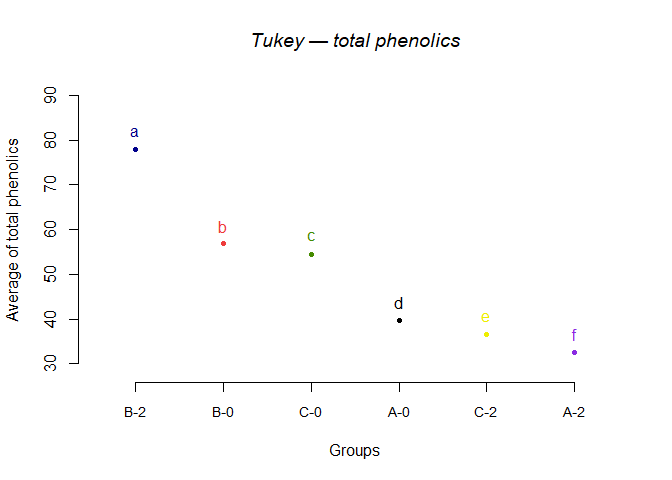
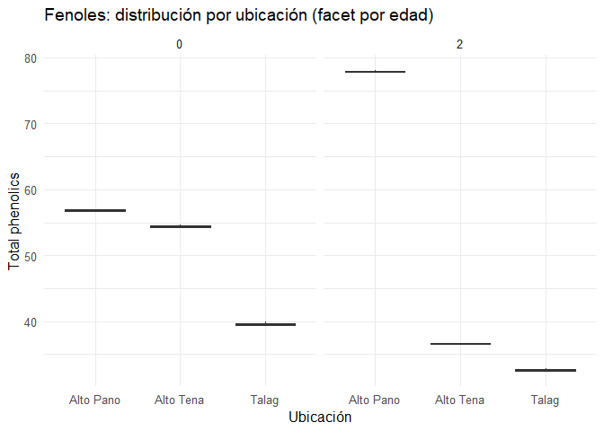
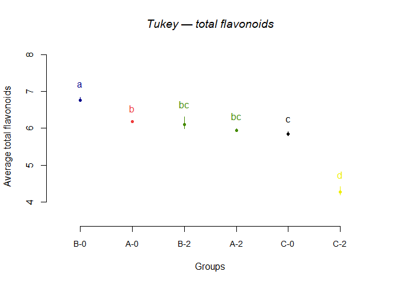
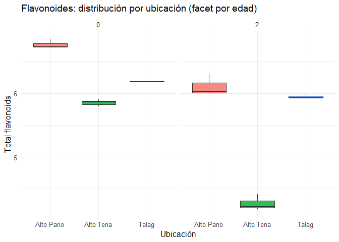
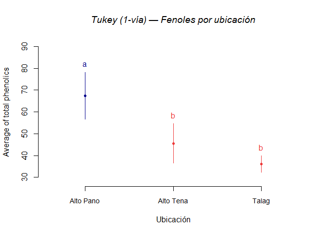
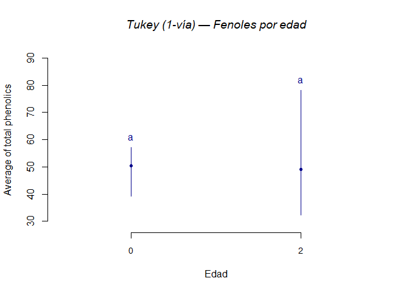
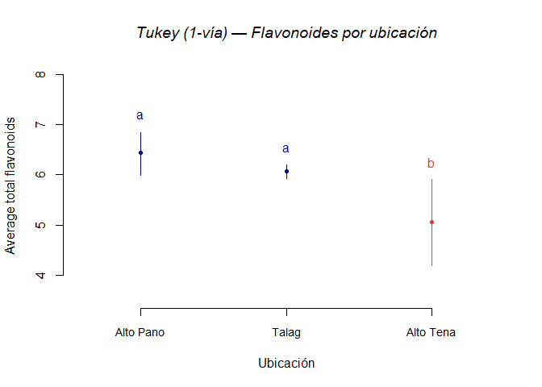
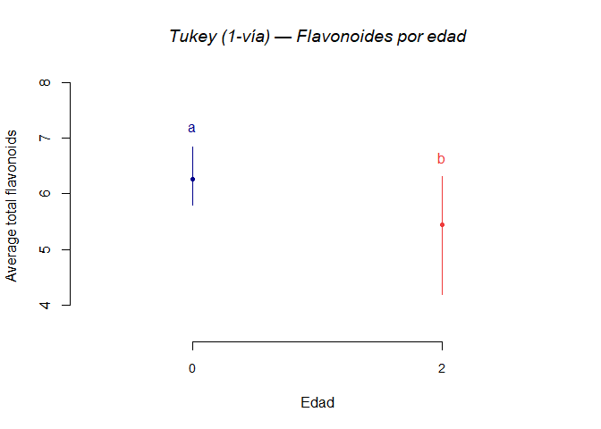

Cuantificación de compuestos fenolicos, flavonoides en *Ilex guayusa*
================
Gabriela Salazar, Thomas Garzón
2025-08-18

- [Objetivo general](#objetivo-general)
  - [Cargado de datos](#cargado-de-datos)
  - [Conversión a factor (simple y
    explícita)](#conversión-a-factor-simple-y-explícita)
- [Fenoles](#fenoles)
  - [Anova](#anova)
  - [Supuestos](#supuestos)
  - [Comparaciones múltiples](#comparaciones-múltiples)
  - [Graficos](#graficos)
    - [Boxplot](#boxplot)
- [Flavonoides](#flavonoides)
  - [Anova](#anova-1)
  - [Supuestos](#supuestos-1)
  - [Comparaciones múltiples](#comparaciones-múltiples-1)
  - [Graficos](#graficos-1)
    - [Tukey](#tukey)
    - [Boxplot](#boxplot-1)
- [División por factores](#división-por-factores)
  - [Fenloes ubicacion- tukey](#fenloes-ubicacion--tukey)
  - [Fenloes Edad- tukey](#fenloes-edad--tukey)
  - [Flavonoides ubicacion- Tukey](#flavonoides-ubicacion--tukey)
  - [Flavonoides Edad- Tukey](#flavonoides-edad--tukey)

# Objetivo general

El presente trabajo tiene el objetivo de evaluar la diferencia entre la
produccion de compuestos fenolicos y flavonoides en ilex guayusa de
diferentes edades.

## Cargado de datos

Las librerías R usadas se enlistan a continuación:

``` r
# Cargado de librerías
# Instala manualmente si hace falta:
# install.packages(c("readxl","dplyr","ggplot2","car","agricolae"))

library(readxl)
library(dplyr)
library(ggplot2)
library(car)        # por si quieres Levene/Anova tipo II
library(agricolae)  # HSD.test (Tukey) y plots base
# Para medias marginales y letras compactas de Tukey
# install.packages(c("emmeans","multcomp"))
library(emmeans)
library(multcomp)  # aporta 'cld' para objetos de emmeans
```

Se usó la carpeta de trabajo del proyecto R como ruta preestablecida.

``` r
ppath <- "../ANOVA"
```

Se subio la data segun su información.

``` r
# Total phenolics
fenoles_df <- data.frame(read_excel(file.path(ppath, "../Data/DATA.xlsx"), sheet = 1))

# Total flavonoids
flavonoides_df <- data.frame(read_excel(file.path(ppath, "../Data/DATA.xlsx"), sheet = 2))
```

## Conversión a factor (simple y explícita)

Convierte las variables categóricas (ubicacion, edad, grupos) a tipo
factor.

Propósito: Asegurar que los modelos ANOVA reconozcan adecuadamente las
variables como factores experimentales y no como variables numéricas.

``` r
# Conversión a factor (simple y explícita)
fenoles_df <- fenoles_df |>
  mutate(
    ubicacion = factor(ubicacion),
    edad      = factor(edad),
    grupos    = factor(grupos)
  )

flavonoides_df <- flavonoides_df |>
  mutate(
    ubicacion = factor(ubicacion),
    edad      = factor(edad),
    grupos    = factor(grupos)
  )

glimpse(fenoles_df)
```

    ## Rows: 18
    ## Columns: 4
    ## $ grupos          <fct> A-0, A-0, A-0, A-2, A-2, A-2, B-0, B-0, B-0, B-2, B-2,…
    ## $ ubicacion       <fct> Talag, Talag, Talag, Talag, Talag, Talag, Alto Pano, A…
    ## $ edad            <fct> 0, 0, 0, 2, 2, 2, 0, 0, 0, 2, 2, 2, 0, 0, 0, 2, 2, 2
    ## $ total_phenolics <dbl> 39.32663, 39.96388, 39.47806, 32.86432, 32.49541, 32.3…

``` r
glimpse(flavonoides_df)
```

    ## Rows: 18
    ## Columns: 4
    ## $ grupos           <fct> A-0, A-0, A-0, A-2, A-2, A-2, B-0, B-0, B-0, B-2, B-2…
    ## $ ubicacion        <fct> Talag, Talag, Talag, Talag, Talag, Talag, Alto Pano, …
    ## $ edad             <fct> 0, 0, 0, 2, 2, 2, 0, 0, 0, 2, 2, 2, 0, 0, 0, 2, 2, 2
    ## $ total_flavonoids <dbl> 6.184758, 6.197075, 6.184758, 5.930005, 5.986576, 5.9…

``` r
# (Opcional)
totalphenolics   <- fenoles_df
totalflavonoids  <- flavonoides_df
```

# Fenoles

## Anova

Ajusta un ANOVA de 1-vía con “grupos”.

Ajusta un ANOVA factorial con ubicacion × edad.

Obtiene tablas ANOVA tipo I y tipo II.

Propósito: Evaluar la significancia estadística de los factores
principales y de la interacción sobre la producción de fenoles.

``` r
#ANOVA 1 vía (factor: grupos)
modelo_bs <- aov(total_phenolics ~ grupos, data = totalphenolics)
summary(modelo_bs)
```

    ##             Df Sum Sq Mean Sq F value Pr(>F)    
    ## grupos       5   4309   861.9   16567 <2e-16 ***
    ## Residuals   12      1     0.1                   
    ## ---
    ## Signif. codes:  0 '***' 0.001 '**' 0.01 '*' 0.05 '.' 0.1 ' ' 1

``` r
# Modelo ANOVA con interacción
fit_feno <- aov(total_phenolics ~ ubicacion * edad, data = fenoles_df)

# Tabla ANOVA (tipo I clásica)
summary(fit_feno)
```

    ##                Df Sum Sq Mean Sq F value   Pr(>F)    
    ## ubicacion       2 3091.2  1545.6 29709.9  < 2e-16 ***
    ## edad            1    7.2     7.2   137.9 6.15e-08 ***
    ## ubicacion:edad  2 1211.1   605.5 11639.5  < 2e-16 ***
    ## Residuals      12    0.6     0.1                     
    ## ---
    ## Signif. codes:  0 '***' 0.001 '**' 0.01 '*' 0.05 '.' 0.1 ' ' 1

``` r
# Alternativa tipo II (marginal) con 'car'
Anova(lm(total_phenolics ~ ubicacion * edad, data = fenoles_df), type = 2)
```

    ## Anova Table (Type II tests)
    ## 
    ## Response: total_phenolics
    ##                 Sum Sq Df  F value    Pr(>F)    
    ## ubicacion      3091.24  2 29709.93 < 2.2e-16 ***
    ## edad              7.18  1   137.93 6.146e-08 ***
    ## ubicacion:edad 1211.06  2 11639.54 < 2.2e-16 ***
    ## Residuals         0.62 12                       
    ## ---
    ## Signif. codes:  0 '***' 0.001 '**' 0.01 '*' 0.05 '.' 0.1 ' ' 1

## Supuestos

Prueba de normalidad de residuales (Shapiro-Wilk).

Prueba de homogeneidad de varianzas (Levene).

Crea una tabla resumen con valores p e interpretación cualitativa.

Propósito: Validar los supuestos del modelo ANOVA antes de interpretar
resultados.

``` r
# Normalidad de residuales
shapiro_feno <- shapiro.test(residuals(fit_feno))

# Homogeneidad de varianzas (Levene) con interacción completa
levene_feno <- leveneTest(total_phenolics ~ ubicacion * edad, data = fenoles_df)

supuestos_feno <- tibble(
  sheet      = "Fenoles",
  response   = "total_phenolics",
  shapiro_p  = round(shapiro_feno$p.value, 4),
  levene_p   = round(levene_feno$`Pr(>F)`[1], 4),
  normalidad = ifelse(shapiro_feno$p.value > 0.05, "No se rechaza normalidad", "Se rechaza normalidad"),
  homogeneidad = ifelse(levene_feno$`Pr(>F)`[1] > 0.05, "Varianzas homogéneas", "Varianzas heterogéneas")
)
supuestos_feno
```

    ## # A tibble: 1 × 6
    ##   sheet   response        shapiro_p levene_p normalidad             homogeneidad
    ##   <chr>   <chr>               <dbl>    <dbl> <chr>                  <chr>       
    ## 1 Fenoles total_phenolics     0.513    0.916 No se rechaza normali… Varianzas h…

## Comparaciones múltiples

Aplica TukeyHSD para ubicacion, edad y su interacción.

Corre HSD.test (agricolae) para el factor “grupos”.

Propósito: Identificar qué pares de medias difieren significativamente
tras el ANOVA

``` r
# Tukey clásico por factor principal y por interacción
TukeyHSD(fit_feno, which = "ubicacion")
```

    ##   Tukey multiple comparisons of means
    ##     95% family-wise confidence level
    ## 
    ## Fit: aov(formula = total_phenolics ~ ubicacion * edad, data = fenoles_df)
    ## 
    ## $ubicacion
    ##                           diff        lwr        upr p adj
    ## Alto Tena-Alto Pano -21.860345 -22.211665 -21.509024     0
    ## Talag-Alto Pano     -31.287088 -31.638409 -30.935768     0
    ## Talag-Alto Tena      -9.426744  -9.778064  -9.075423     0

``` r
TukeyHSD(fit_feno, which = "edad")
```

    ##   Tukey multiple comparisons of means
    ##     95% family-wise confidence level
    ## 
    ## Fit: aov(formula = total_phenolics ~ ubicacion * edad, data = fenoles_df)
    ## 
    ## $edad
    ##          diff       lwr       upr p adj
    ## 2-0 -1.262755 -1.497024 -1.028487 1e-07

``` r
TukeyHSD(fit_feno, which = "ubicacion:edad")
```

    ##   Tukey multiple comparisons of means
    ##     95% family-wise confidence level
    ## 
    ## Fit: aov(formula = total_phenolics ~ ubicacion * edad, data = fenoles_df)
    ## 
    ## $`ubicacion:edad`
    ##                               diff        lwr        upr p adj
    ## Alto Tena:0-Alto Pano:0  -2.393703  -3.019243  -1.768164 3e-07
    ## Talag:0-Alto Pano:0     -17.246420 -17.871959 -16.620880 0e+00
    ## Alto Pano:2-Alto Pano:0  21.075451  20.449912  21.700991 0e+00
    ## Alto Tena:2-Alto Pano:0 -20.251535 -20.877074 -19.625995 0e+00
    ## Talag:2-Alto Pano:0     -24.252305 -24.877845 -23.626766 0e+00
    ## Talag:0-Alto Tena:0     -14.852717 -15.478256 -14.227177 0e+00
    ## Alto Pano:2-Alto Tena:0  23.469154  22.843615  24.094694 0e+00
    ## Alto Tena:2-Alto Tena:0 -17.857831 -18.483371 -17.232292 0e+00
    ## Talag:2-Alto Tena:0     -21.858602 -22.484142 -21.233063 0e+00
    ## Alto Pano:2-Talag:0      38.321871  37.696332  38.947410 0e+00
    ## Alto Tena:2-Talag:0      -3.005115  -3.630654  -2.379575 0e+00
    ## Talag:2-Talag:0          -7.005886  -7.631425  -6.380346 0e+00
    ## Alto Tena:2-Alto Pano:2 -41.326986 -41.952525 -40.701446 0e+00
    ## Talag:2-Alto Pano:2     -45.327757 -45.953296 -44.702217 0e+00
    ## Talag:2-Alto Tena:2      -4.000771  -4.626310  -3.375231 0e+00

``` r
tukey_bs <- HSD.test(modelo_bs, trt = "grupos", group = TRUE, console = TRUE)
```

    ## 
    ## Study: modelo_bs ~ "grupos"
    ## 
    ## HSD Test for total_phenolics 
    ## 
    ## Mean Square Error:  0.05202369 
    ## 
    ## grupos,  means
    ## 
    ##     total_phenolics       std r        se      Min      Max      Q25      Q50
    ## A-0        39.58952 0.3329286 3 0.1316861 39.32663 39.96388 39.40234 39.47806
    ## A-2        32.58364 0.2486007 3 0.1316861 32.39119 32.86432 32.44330 32.49541
    ## B-0        56.83594 0.1977357 3 0.1316861 56.61499 56.99627 56.75578 56.89657
    ## B-2        77.91139 0.1566218 3 0.1316861 77.78227 78.08562 77.82428 77.86629
    ## C-0        54.44224 0.2501410 3 0.1316861 54.19375 54.69400 54.31636 54.43897
    ## C-2        36.58441 0.1153169 3 0.1316861 36.45652 36.68047 36.53638 36.61624
    ##          Q75
    ## A-0 39.72097
    ## A-2 32.67986
    ## B-0 56.94642
    ## B-2 77.97596
    ## C-0 54.56649
    ## C-2 36.64835
    ## 
    ## Alpha: 0.05 ; DF Error: 12 
    ## Critical Value of Studentized Range: 4.750231 
    ## 
    ## Minimun Significant Difference: 0.6255395 
    ## 
    ## Treatments with the same letter are not significantly different.
    ## 
    ##     total_phenolics groups
    ## B-2        77.91139      a
    ## B-0        56.83594      b
    ## C-0        54.44224      c
    ## A-0        39.58952      d
    ## C-2        36.58441      e
    ## A-2        32.58364      f

``` r
tukey_bs$groups  # letras por grupo
```

    ##     total_phenolics groups
    ## B-2        77.91139      a
    ## B-0        56.83594      b
    ## C-0        54.44224      c
    ## A-0        39.58952      d
    ## C-2        36.58441      e
    ## A-2        32.58364      f

## Graficos

\#Tukey

Muestra el gráfico clásico de Tukey generado por HSD.test sobre
“grupos”.

Propósito: Visualizar diferencias entre grupos con letras de
significancia.

``` r
tk_TPC <- plot(tukey_bs,
     cex.names = 0.9,
     ylab = "Average of total phenolics",
     xlab = "Groups",
     main = "Tukey — total phenolics",
     font.main = 3)
```

<!-- -->

``` r
tk_TPC
```

    ##      [,1]
    ## [1,]  0.7
    ## [2,]  1.9
    ## [3,]  3.1
    ## [4,]  4.3
    ## [5,]  5.5
    ## [6,]  6.7

``` r
# Save plot (más ancho)
# Guardar como PDF
#pdf("tk_TPC.pdf", width = 6, height = 4)
#plot(tukey_bs,
#     cex.names = 0.9,
#     ylab = "Average of total phenolics",
#     xlab = "Groups",
#     main = "Tukey — total phenolics",
#     font.main = 3)
#dev.off()

# Guardar como PNG
#png("tk_TPC.png", width = 6, height = 4, units = "in", res = 300)
#plot(tukey_bs,
#     cex.names = 0.9,
#     ylab = "Average of total phenolics",
#     xlab = "Groups",
#     main = "Tukey — total phenolics",
#     font.main = 3)
#dev.off()
```

### Boxplot

Boxplot de fenoles por ubicación, facetado por edad.

Propósito: Explorar gráficamente la distribución y detectar patrones o
posibles interacciones.

``` r
# Boxplot por ubicación facet por edad
ggplot(fenoles_df, aes(x = ubicacion, y = total_phenolics, fill = ubicacion)) +
  geom_boxplot(width = 0.7, alpha = 0.85, outlier.shape = 21) +
  facet_wrap(~ edad, nrow = 1) +
  labs(title = "Fenoles: distribución por ubicación (facet por edad)",
       x = "Ubicación", y = "Total phenolics") +
  theme_minimal(base_size = 12) +
  theme(legend.position = "none")
```

<!-- -->

# Flavonoides

## Anova

ANOVA 1-vía por grupos.

ANOVA factorial ubicacion × edad.

Propósito: Repetir el análisis de varianza para la respuesta “total
flavonoids”.

``` r
modelo_bx <- aov(total_flavonoids ~ grupos, data = totalflavonoids)
summary(modelo_bx)
```

    ##             Df Sum Sq Mean Sq F value   Pr(>F)    
    ## grupos       5  10.54  2.1077   230.4 1.74e-11 ***
    ## Residuals   12   0.11  0.0091                     
    ## ---
    ## Signif. codes:  0 '***' 0.001 '**' 0.01 '*' 0.05 '.' 0.1 ' ' 1

``` r
fit_flav <- aov(total_flavonoids ~ ubicacion * edad, data = flavonoides_df)

summary(fit_flav)
```

    ##                Df Sum Sq Mean Sq F value   Pr(>F)    
    ## ubicacion       2  6.055  3.0276   331.0 3.19e-11 ***
    ## edad            1  3.076  3.0764   336.3 3.83e-10 ***
    ## ubicacion:edad  2  1.407  0.7035    76.9 1.44e-07 ***
    ## Residuals      12  0.110  0.0091                     
    ## ---
    ## Signif. codes:  0 '***' 0.001 '**' 0.01 '*' 0.05 '.' 0.1 ' ' 1

``` r
Anova(lm(total_flavonoids ~ ubicacion * edad, data = flavonoides_df), type = 2)
```

    ## Anova Table (Type II tests)
    ## 
    ## Response: total_flavonoids
    ##                Sum Sq Df F value    Pr(>F)    
    ## ubicacion      6.0551  2 330.982 3.186e-11 ***
    ## edad           3.0764  1 336.321 3.829e-10 ***
    ## ubicacion:edad 1.4069  2  76.903 1.437e-07 ***
    ## Residuals      0.1098 12                      
    ## ---
    ## Signif. codes:  0 '***' 0.001 '**' 0.01 '*' 0.05 '.' 0.1 ' ' 1

## Supuestos

Normalidad (Shapiro-Wilk).

Homogeneidad de varianzas (Levene).

Tabla resumen con interpretación cualitativa.

Propósito: Comprobar que los datos de flavonoides cumplen los criterios
para ANOVA.

``` r
shapiro_flav <- shapiro.test(residuals(fit_flav))
shapiro_flav
```

    ## 
    ##  Shapiro-Wilk normality test
    ## 
    ## data:  residuals(fit_flav)
    ## W = 0.93277, p-value = 0.2172

``` r
levene_flav <- leveneTest(total_flavonoids ~ ubicacion * edad, data = flavonoides_df)
levene_flav
```

    ## Levene's Test for Homogeneity of Variance (center = median)
    ##       Df F value Pr(>F)
    ## group  5  0.6209  0.687
    ##       12

``` r
supuestos_flav <- tibble::tibble(
  variable = "total_flavonoids",
  shapiro_p = round(shapiro_flav$p.value, 4),
  levene_p  = round(levene_flav$`Pr(>F)`[1], 4),
  normalidad = ifelse(shapiro_flav$p.value > 0.05, "No se rechaza normalidad", "Se rechaza normalidad"),
  homogeneidad = ifelse(levene_flav$`Pr(>F)`[1] > 0.05, "Varianzas homogéneas", "Varianzas heterogéneas")
)
supuestos_flav
```

    ## # A tibble: 1 × 5
    ##   variable         shapiro_p levene_p normalidad               homogeneidad     
    ##   <chr>                <dbl>    <dbl> <chr>                    <chr>            
    ## 1 total_flavonoids     0.217    0.687 No se rechaza normalidad Varianzas homogé…

## Comparaciones múltiples

TukeyHSD para ubicación, edad e interacción.

HSD.test para grupos.

Propósito: Determinar qué comparaciones son significativas.

``` r
TukeyHSD(fit_flav, which = "ubicacion")
```

    ##   Tukey multiple comparisons of means
    ##     95% family-wise confidence level
    ## 
    ## Fit: aov(formula = total_flavonoids ~ ubicacion * edad, data = flavonoides_df)
    ## 
    ## $ubicacion
    ##                           diff        lwr       upr    p adj
    ## Alto Tena-Alto Pano -1.3721805 -1.5194957 -1.224865 0.00e+00
    ## Talag-Alto Pano     -0.3673032 -0.5146184 -0.219988 6.48e-05
    ## Talag-Alto Tena      1.0048773  0.8575621  1.152193 0.00e+00

``` r
TukeyHSD(fit_flav, which = "edad")
```

    ##   Tukey multiple comparisons of means
    ##     95% family-wise confidence level
    ## 
    ## Fit: aov(formula = total_flavonoids ~ ubicacion * edad, data = flavonoides_df)
    ## 
    ## $edad
    ##           diff        lwr        upr p adj
    ## 2-0 -0.8268284 -0.9250616 -0.7285952     0

``` r
TukeyHSD(fit_flav, which = "ubicacion:edad")
```

    ##   Tukey multiple comparisons of means
    ##     95% family-wise confidence level
    ## 
    ## Fit: aov(formula = total_flavonoids ~ ubicacion * edad, data = flavonoides_df)
    ## 
    ## $`ubicacion:edad`
    ##                                diff         lwr         upr     p adj
    ## Alto Tena:0-Alto Pano:0 -0.91316775 -1.17546806 -0.65086744 0.0000008
    ## Talag:0-Alto Pano:0     -0.57791741 -0.84021771 -0.31561710 0.0000941
    ## Alto Pano:2-Alto Pano:0 -0.66122936 -0.92352966 -0.39892905 0.0000242
    ## Alto Tena:2-Alto Pano:0 -2.49242263 -2.75472293 -2.23012232 0.0000000
    ## Talag:2-Alto Pano:0     -0.81791834 -1.08021865 -0.55561804 0.0000026
    ## Talag:0-Alto Tena:0      0.33525034  0.07295004  0.59755065 0.0103586
    ## Alto Pano:2-Alto Tena:0  0.25193839 -0.01036191  0.51423870 0.0623914
    ## Alto Tena:2-Alto Tena:0 -1.57925488 -1.84155518 -1.31695457 0.0000000
    ## Talag:2-Alto Tena:0      0.09524941 -0.16705090  0.35754971 0.8195913
    ## Alto Pano:2-Talag:0     -0.08331195 -0.34561226  0.17898836 0.8852996
    ## Alto Tena:2-Talag:0     -1.91450522 -2.17680553 -1.65220491 0.0000000
    ## Talag:2-Talag:0         -0.24000094 -0.50230124  0.02229937 0.0803163
    ## Alto Tena:2-Alto Pano:2 -1.83119327 -2.09349358 -1.56889297 0.0000000
    ## Talag:2-Alto Pano:2     -0.15668899 -0.41898929  0.10561132 0.3923044
    ## Talag:2-Alto Tena:2      1.67450428  1.41220398  1.93680459 0.0000000

``` r
tukey_bx <- HSD.test(modelo_bx, trt = "grupos", group = TRUE, console = TRUE)
```

    ## 
    ## Study: modelo_bx ~ "grupos"
    ## 
    ## HSD Test for total_flavonoids 
    ## 
    ## Mean Square Error:  0.009147224 
    ## 
    ## grupos,  means
    ## 
    ##     total_flavonoids        std r         se      Min      Max      Q25
    ## A-0         6.188863 0.00711132 3 0.05521843 6.184758 6.197075 6.184758
    ## A-2         5.948862 0.03266121 3 0.05521843 5.930005 5.986576 5.930005
    ## B-0         6.766781 0.06900225 3 0.05521843 6.726942 6.846458 6.726942
    ## B-2         6.105551 0.17591210 3 0.05521843 5.985047 6.307416 6.004619
    ## C-0         5.853613 0.05831235 3 0.05521843 5.791786 5.907621 5.826609
    ## C-2         4.274358 0.12107564 3 0.05521843 4.190036 4.413094 4.204990
    ##          Q50      Q75
    ## A-0 6.184758 6.190916
    ## A-2 5.930005 5.958291
    ## B-0 6.726942 6.786700
    ## B-2 6.024191 6.165803
    ## C-0 5.861432 5.884527
    ## C-2 4.219944 4.316519
    ## 
    ## Alpha: 0.05 ; DF Error: 12 
    ## Critical Value of Studentized Range: 4.750231 
    ## 
    ## Minimun Significant Difference: 0.2623003 
    ## 
    ## Treatments with the same letter are not significantly different.
    ## 
    ##     total_flavonoids groups
    ## B-0         6.766781      a
    ## A-0         6.188863      b
    ## B-2         6.105551     bc
    ## A-2         5.948862     bc
    ## C-0         5.853613      c
    ## C-2         4.274358      d

``` r
tukey_bx$groups
```

    ##     total_flavonoids groups
    ## B-0         6.766781      a
    ## A-0         6.188863      b
    ## B-2         6.105551     bc
    ## A-2         5.948862     bc
    ## C-0         5.853613      c
    ## C-2         4.274358      d

## Graficos

### Tukey

Gráfico base R con letras de Tukey para grupos.

Propósito: Facilitar la interpretación visual de las diferencias.

``` r
tk_TFC <- plot(tukey_bx,
     cex.names = 0.9,
     ylab = "Average total flavonoids",
     xlab = "Groups",
     main = "Tukey — total flavonoids",
     font.main = 3)
```

<!-- -->

``` r
# Save plot (más ancho)
# Guardar como PDF
#pdf("tk_TFC.pdf", width = 6, height = 4)
#plot(tukey_bx,
#     cex.names = 0.9,
#     ylab = "Average of total phenolics",
#     xlab = "Groups",
#     main = "Tukey — total phenolics",
#     font.main = 3)
#dev.off()

# Guardar como PNG
#png("tk_TFC.png", width = 6, height = 4, units = "in", res = 300)
#plot(tukey_bx,
#     cex.names = 0.9,
#     ylab = "Average of total phenolics",
#     xlab = "Groups",
#     main = "Tukey — total phenolics",
#     font.main = 3)
#dev.off()
```

### Boxplot

Boxplot de flavonoides por ubicación, facetado por edad.

Propósito: Mostrar la variación entre ubicaciones y edades, resaltando
posibles interacciones.

``` r
ggplot(flavonoides_df, aes(x = ubicacion, y = total_flavonoids, fill = ubicacion)) +
  geom_boxplot(width = 0.7, alpha = 0.85, outlier.shape = 21) +
  facet_wrap(~ edad, nrow = 1) +
  labs(title = "Flavonoides: distribución por ubicación (facet por edad)",
       x = "Ubicación", y = "Total flavonoids") +
  theme_minimal(base_size = 12) +
  theme(legend.position = "none")
```

<!-- -->

# División por factores

Se realizo lo mismo que en anteriores paso pero enfocado a vizaulizar
por facto, finalmente se encontro poca variabilidad entre factores.

## Fenloes ubicacion- tukey

``` r
# 1) Ubicación
modelo_feno_ubic_1v <- aov(total_phenolics ~ ubicacion, data = fenoles_df)
tukey_feno_ubic_1v  <- HSD.test(modelo_feno_ubic_1v, trt = "ubicacion", group = TRUE, console = TRUE)
```

    ## 
    ## Study: modelo_feno_ubic_1v ~ "ubicacion"
    ## 
    ## HSD Test for total_phenolics 
    ## 
    ## Mean Square Error:  81.25754 
    ## 
    ## ubicacion,  means
    ## 
    ##           total_phenolics       std r       se      Min      Max      Q25
    ## Alto Pano        67.37367 11.544602 6 3.680071 56.61499 78.08562 56.92149
    ## Alto Tena        45.51332  9.782688 6 3.680071 36.45652 54.69400 36.63230
    ## Talag            36.08658  3.846269 6 3.680071 32.39119 39.96388 32.58763
    ##                Q50      Q75
    ## Alto Pano 67.38927 77.84529
    ## Alto Tena 45.43711 54.37767
    ## Talag     36.09547 39.44020
    ## 
    ## Alpha: 0.05 ; DF Error: 15 
    ## Critical Value of Studentized Range: 3.673378 
    ## 
    ## Minimun Significant Difference: 13.51829 
    ## 
    ## Treatments with the same letter are not significantly different.
    ## 
    ##           total_phenolics groups
    ## Alto Pano        67.37367      a
    ## Alto Tena        45.51332      b
    ## Talag            36.08658      b

``` r
plot(tukey_feno_ubic_1v,
     cex.names = 0.9,
     ylab = "Average of total phenolics",
     xlab = "Ubicación",
     main = "Tukey (1-vía) — Fenoles por ubicación",
     font.main = 3)
```

<!-- -->

## Fenloes Edad- tukey

``` r
# 2) Edad
modelo_feno_edad_1v <- aov(total_phenolics ~ edad, data = fenoles_df)
tukey_feno_edad_1v  <- HSD.test(modelo_feno_edad_1v, trt = "edad", group = TRUE, console = TRUE)
```

    ## 
    ## Study: modelo_feno_edad_1v ~ "edad"
    ## 
    ## HSD Test for total_phenolics 
    ## 
    ## Mean Square Error:  268.933 
    ## 
    ## edad,  means
    ## 
    ##   total_phenolics       std r       se      Min      Max      Q25      Q50
    ## 0        50.28924  8.094728 9 5.466392 39.32663 56.99627 39.96388 54.43897
    ## 2        49.02648 21.733415 9 5.466392 32.39119 78.08562 32.86432 36.61624
    ##        Q75
    ## 0 56.61499
    ## 2 77.78227
    ## 
    ## Alpha: 0.05 ; DF Error: 16 
    ## Critical Value of Studentized Range: 2.997999 
    ## 
    ## Minimun Significant Difference: 16.38824 
    ## 
    ## Treatments with the same letter are not significantly different.
    ## 
    ##   total_phenolics groups
    ## 0        50.28924      a
    ## 2        49.02648      a

``` r
plot(tukey_feno_edad_1v,
     cex.names = 0.9,
     ylab = "Average of total phenolics",
     xlab = "Edad",
     main = "Tukey (1-vía) — Fenoles por edad",
     font.main = 3)
```

<!-- -->

## Flavonoides ubicacion- Tukey

``` r
# 1) Ubicación
modelo_flav_ubic_1v <- aov(total_flavonoids ~ ubicacion, data = flavonoides_df)
tukey_flav_ubic_1v  <- HSD.test(modelo_flav_ubic_1v, trt = "ubicacion", group = TRUE, console = TRUE)
```

    ## 
    ## Study: modelo_flav_ubic_1v ~ "ubicacion"
    ## 
    ## HSD Test for total_flavonoids 
    ## 
    ## Mean Square Error:  0.3062048 
    ## 
    ## ubicacion,  means
    ## 
    ##           total_flavonoids       std r        se      Min      Max      Q25
    ## Alto Pano         6.436166 0.3813789 6 0.2259074 5.985047 6.846458 6.094997
    ## Alto Tena         5.063985 0.8691592 6 0.2259074 4.190036 5.907621 4.268231
    ## Talag             6.068863 0.1331430 6 0.2259074 5.930005 6.197075 5.944148
    ##                Q50      Q75
    ## Alto Pano 6.517179 6.726942
    ## Alto Tena 5.102440 5.844020
    ## Talag     6.085667 6.184758
    ## 
    ## Alpha: 0.05 ; DF Error: 15 
    ## Critical Value of Studentized Range: 3.673378 
    ## 
    ## Minimun Significant Difference: 0.8298431 
    ## 
    ## Treatments with the same letter are not significantly different.
    ## 
    ##           total_flavonoids groups
    ## Alto Pano         6.436166      a
    ## Talag             6.068863      a
    ## Alto Tena         5.063985      b

``` r
plot(tukey_flav_ubic_1v,
     cex.names = 0.9,
     ylab = "Average total flavonoids",
     xlab = "Ubicación",
     main = "Tukey (1-vía) — Flavonoides por ubicación",
     font.main = 3)
```

<!-- -->

## Flavonoides Edad- Tukey

``` r
# 2) Edad
modelo_flav_edad_1v <- aov(total_flavonoids ~ edad, data = flavonoides_df)
tukey_flav_edad_1v  <- HSD.test(modelo_flav_edad_1v, trt = "edad", group = TRUE, console = TRUE)
```

    ## 
    ## Study: modelo_flav_edad_1v ~ "edad"
    ## 
    ## HSD Test for total_flavonoids 
    ## 
    ## Mean Square Error:  0.473238 
    ## 
    ## edad,  means
    ## 
    ##   total_flavonoids       std r        se      Min      Max      Q25      Q50
    ## 0         6.269752 0.4025980 9 0.2293077 5.791786 6.846458 5.907621 6.184758
    ## 2         5.442924 0.8856584 9 0.2293077 4.190036 6.307416 4.413094 5.930005
    ##        Q75
    ## 0 6.726942
    ## 2 5.986576
    ## 
    ## Alpha: 0.05 ; DF Error: 16 
    ## Critical Value of Studentized Range: 2.997999 
    ## 
    ## Minimun Significant Difference: 0.6874641 
    ## 
    ## Treatments with the same letter are not significantly different.
    ## 
    ##   total_flavonoids groups
    ## 0         6.269752      a
    ## 2         5.442924      b

``` r
plot(tukey_flav_edad_1v,
     cex.names = 0.9,
     ylab = "Average total flavonoids",
     xlab = "Edad",
     main = "Tukey (1-vía) — Flavonoides por edad",
     font.main = 3)
```

<!-- -->
