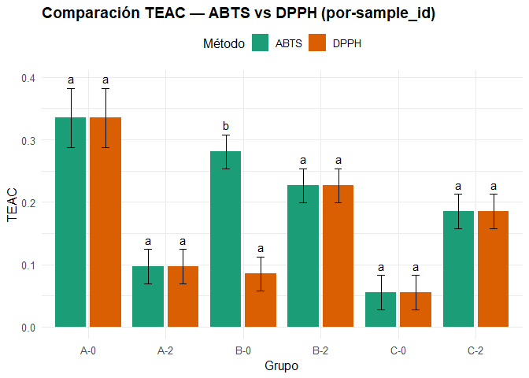
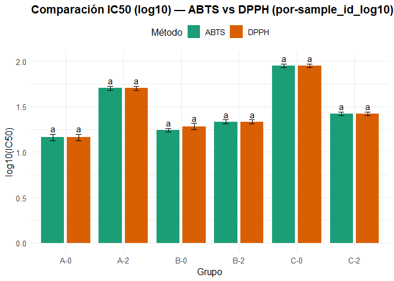
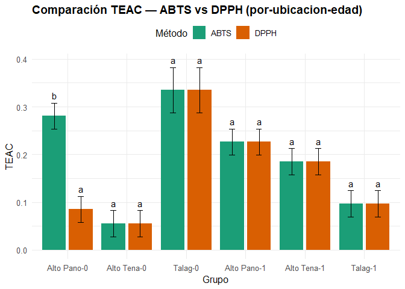
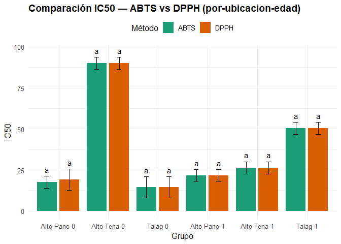
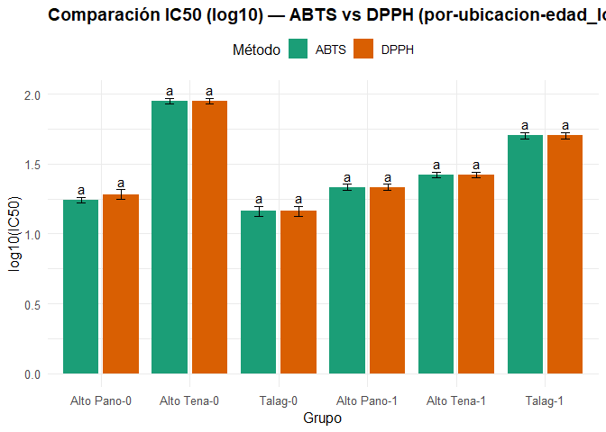

Comparation actividad antioxidante ABTS/DPPH en *Ilex guayusa*
================
Gabriela Salazar, Thomas Garzón
2025-08-19

``` r
# ================== Paquetes ==================
# install.packages(c("tidyverse","emmeans","multcomp","multcompView","readr"))
library(tidyverse)
```

    ## ── Attaching core tidyverse packages ──────────────────────── tidyverse 2.0.0 ──
    ## ✔ dplyr     1.1.4     ✔ readr     2.1.5
    ## ✔ forcats   1.0.0     ✔ stringr   1.5.1
    ## ✔ ggplot2   3.5.1     ✔ tibble    3.2.1
    ## ✔ lubridate 1.9.4     ✔ tidyr     1.3.1
    ## ✔ purrr     1.0.2     
    ## ── Conflicts ────────────────────────────────────────── tidyverse_conflicts() ──
    ## ✖ dplyr::filter() masks stats::filter()
    ## ✖ dplyr::lag()    masks stats::lag()
    ## ℹ Use the conflicted package (<http://conflicted.r-lib.org/>) to force all conflicts to become errors

``` r
library(emmeans)
```

    ## Welcome to emmeans.
    ## Caution: You lose important information if you filter this package's results.
    ## See '? untidy'

``` r
library(multcomp)
```

    ## Cargando paquete requerido: mvtnorm
    ## Cargando paquete requerido: survival
    ## Cargando paquete requerido: TH.data
    ## Cargando paquete requerido: MASS
    ## 
    ## Adjuntando el paquete: 'MASS'
    ## 
    ## The following object is masked from 'package:dplyr':
    ## 
    ##     select
    ## 
    ## 
    ## Adjuntando el paquete: 'TH.data'
    ## 
    ## The following object is masked from 'package:MASS':
    ## 
    ##     geyser

``` r
library(multcompView)
library(readr)
```

``` r
# ================== Entradas ==================
ppath <- "../ANOVA"
path_excel_ABTS <- "../Results/Outputs/TEAC_table-ABTS.csv"
path_excel_DPPH <- "../Results/Outputs/TEAC_table-DPPH.csv"

# Carpeta de salida
out_dir <- file.path(ppath, "Comparacion_TEAC_IC50")
dir.create(out_dir, recursive = TRUE, showWarnings = FALSE)
```

``` r
# ================== Lectura ===================
abts <- readr::read_csv(path_excel_ABTS, show_col_types = FALSE) |>
  mutate(metodo = "ABTS")
dpph <- readr::read_csv(path_excel_DPPH, show_col_types = FALSE) |>
  mutate(metodo = "DPPH")

datos <- bind_rows(abts, dpph) |>
  mutate(
    metodo    = factor(metodo, levels = c("ABTS","DPPH")),
    sample_id = as.factor(sample_id),
    ubicacion = as.factor(ubicacion),
    edad      = as.factor(edad),
    ic50      = suppressWarnings(as.numeric(ic50)),
    teac      = suppressWarnings(as.numeric(teac))
  )

# (Opcional) filtrar extremos numéricos imposibles que provienen de fallos de ajuste
flag_ic50_big <- is.finite(datos$ic50) & datos$ic50 > 1e6
flag_teac_big <- is.finite(datos$teac) & datos$teac > 1e6
if (any(flag_ic50_big)) warning(sum(flag_ic50_big), " valores de IC50 >1e6 se marcaron como NA.")
```

    ## Warning: 2 valores de IC50 >1e6 se marcaron como NA.

``` r
if (any(flag_teac_big)) warning(sum(flag_teac_big), " valores de TEAC >1e6 se marcaron como NA.")
datos$ic50[flag_ic50_big] <- NA_real_
datos$teac[flag_teac_big] <- NA_real_
```

``` r
# ================== Utilidades =================
pal_met <- c("ABTS"="#1b9e77","DPPH"="#d95f02")

formatea_media_se <- function(m, se, digits = 3) {
  paste0(formatC(m, format="f", digits=digits), " \u00B1 ",
         formatC(se, format="f", digits=digits))
}

# Gráfico + tabla (por endpoint y esquema de agrupación)
run_endpoint <- function(data, endpoint = c("TEAC","IC50"),
                         group_label = c("sample_id","ubicacion-edad")) {

  endpoint <- rlang::arg_match(endpoint)
  group_label <- rlang::arg_match(group_label)

  # Variable de respuesta
  yvar <- if (endpoint == "TEAC") "teac" else "ic50"

  # Definir 'grupo'
  d <- data
  if (group_label == "sample_id") {
    d <- d |> mutate(grupo = droplevels(as.factor(sample_id)))
    sufijo <- "por-sample_id"
  } else {
    d <- d |> mutate(grupo = droplevels(interaction(ubicacion, edad, sep = "-")))
    sufijo <- "por-ubicacion-edad"
  }

  d <- d |> filter(!is.na(.data[[yvar]]))

  # Modelo
  fml <- stats::as.formula(paste(yvar, "~ metodo * grupo"))
  mod <- aov(fml, data = d)

  # Emmeans y letras Tukey (comparación ABTS vs DPPH dentro de cada grupo)
  emm <- emmeans(mod, ~ metodo | grupo)
  cld_tbl <- multcomp::cld(emm, Letters = letters, adjust = "tukey") |>
    as_tibble() |>
    rename(media = emmean, se = SE) |>
    mutate(
      .group = stringr::str_trim(.group),
      metodo = factor(metodo, levels = c("ABTS","DPPH"))
    )

  # n por barra
  n_tab <- d |>
    group_by(grupo, metodo) |>
    summarise(n = sum(!is.na(.data[[yvar]])), .groups = "drop")

  out_tab <- cld_tbl |>
    left_join(n_tab, by = c("grupo","metodo")) |>
    transmute(
      esquema = group_label,
      endpoint = endpoint,
      grupo, metodo,
      n,
      media = media,
      se = se,
      `media ± EE` = formatea_media_se(media, se),
      letras = .group
    ) |>
    arrange(grupo, metodo)

  # Guardar tabla
  out_csv <- file.path(out_dir,
                       paste0("tabla_", endpoint, "_", sufijo, ".csv"))
  readr::write_csv(out_tab, out_csv)

  # Gráfico
  offs <- 0.03 * (max(cld_tbl$media, na.rm=TRUE) - min(cld_tbl$media, na.rm=TRUE))
  ann  <- cld_tbl |> mutate(y_lab = media + se + offs)

  ylab <- if (endpoint == "TEAC") "TEAC"
          else                    "IC50"

  titulo <- paste0("Comparación ", endpoint, " — ABTS vs DPPH (", sufijo, ")")

  p <- ggplot(cld_tbl, aes(x = grupo, y = media, fill = metodo)) +
    geom_col(position = position_dodge(width = 0.9), width = 0.8) +
    geom_errorbar(aes(ymin = media - se, ymax = media + se),
                  position = position_dodge(width = 0.9), width = 0.2) +
    geom_text(data = ann,
              aes(y = y_lab, label = .group, group = metodo),
              position = position_dodge(width = 0.9), vjust = 0, size = 4) +
    scale_fill_manual(values = pal_met) +
    labs(x = "Grupo", y = ylab, fill = "Método", title = titulo) +
    theme_minimal(base_size = 12) +
    theme(plot.title = element_text(face = "bold"),
          axis.text.x = element_text(angle = 0, vjust = 0.9),
          legend.position = "top")

  # Exportar
  ggsave(file.path(out_dir, paste0("barras_tukey_", endpoint, "_", sufijo, ".png")),
         p, width = 12, height = 8, units = "in", dpi = 300)
  ggsave(file.path(out_dir, paste0("barras_tukey_", endpoint, "_", sufijo, ".pdf")),
         p, width = 12, height = 8, units = "in", dpi = 300)

  list(modelo = mod, emm = emm, letras = cld_tbl,
       tabla = out_tab, plot = p, csv = out_csv)
}
```

``` r
# ================== Utilidades =================
pal_met <- c("ABTS"="#1b9e77","DPPH"="#d95f02")

formatea_media_se <- function(m, se, digits = 3) {
  paste0(formatC(m, format="f", digits=digits), " \u00B1 ",
         formatC(se, format="f", digits=digits))
}

# Gráfico + tabla (por endpoint y esquema de agrupación)
run_endpoint <- function(data, endpoint = c("TEAC","IC50"),
                         group_label = c("sample_id","ubicacion-edad"),
                         log_transform = FALSE) {

  endpoint <- rlang::arg_match(endpoint)
  group_label <- rlang::arg_match(group_label)

  # Variable de respuesta
  yvar <- if (endpoint == "TEAC") "teac" else "ic50"

  # Definir 'grupo'
  d <- data
  if (group_label == "sample_id") {
    d <- d |> mutate(grupo = droplevels(as.factor(sample_id)))
    sufijo <- "por-sample_id"
  } else {
    d <- d |> mutate(grupo = droplevels(interaction(ubicacion, edad, sep = "-")))
    sufijo <- "por-ubicacion-edad"
  }

  # Filtro NA
  d <- d |> filter(!is.na(.data[[yvar]]))

  # Transformación logarítmica si aplica
  if (log_transform) {
    d <- d |> mutate(yvar_trans = log10(.data[[yvar]]))
    y_for_model <- "yvar_trans"
    ylab <- paste0("log10(", endpoint, ")")
    sufijo <- paste0(sufijo, "_log10")
  } else {
    y_for_model <- yvar
    ylab <- endpoint
  }

  # Modelo
  fml <- stats::as.formula(paste(y_for_model, "~ metodo * grupo"))
  mod <- aov(fml, data = d)

  # Emmeans y letras Tukey (comparación ABTS vs DPPH dentro de cada grupo)
  emm <- emmeans(mod, ~ metodo | grupo)
  cld_tbl <- multcomp::cld(emm, Letters = letters, adjust = "tukey") |>
    as_tibble() |>
    rename(media = emmean, se = SE) |>
    mutate(
      .group = stringr::str_trim(.group),
      metodo = factor(metodo, levels = c("ABTS","DPPH"))
    )

  # n por barra
  n_tab <- d |>
    group_by(grupo, metodo) |>
    summarise(n = sum(!is.na(.data[[yvar]])), .groups = "drop")

  out_tab <- cld_tbl |>
    left_join(n_tab, by = c("grupo","metodo")) |>
    transmute(
      esquema = group_label,
      endpoint = ifelse(log_transform, paste0("log10_", endpoint), endpoint),
      grupo, metodo,
      n,
      media = media,
      se = se,
      `media ± EE` = formatea_media_se(media, se),
      letras = .group
    ) |>
    arrange(grupo, metodo)

  # Guardar tabla
  out_csv <- file.path(out_dir,
                       paste0("tabla_", endpoint, "_", sufijo, ".csv"))
  readr::write_csv(out_tab, out_csv)

  # Gráfico
  offs <- 0.03 * (max(cld_tbl$media, na.rm=TRUE) - min(cld_tbl$media, na.rm=TRUE))
  ann  <- cld_tbl |> mutate(y_lab = media + se + offs)

  titulo <- paste0("Comparación ", endpoint, 
                   if (log_transform) " (log10)" else "", 
                   " — ABTS vs DPPH (", sufijo, ")")

  p <- ggplot(cld_tbl, aes(x = grupo, y = media, fill = metodo)) +
    geom_col(position = position_dodge(width = 0.9), width = 0.8) +
    geom_errorbar(aes(ymin = media - se, ymax = media + se),
                  position = position_dodge(width = 0.9), width = 0.2) +
    geom_text(data = ann,
              aes(y = y_lab, label = .group, group = metodo),
              position = position_dodge(width = 0.9), vjust = 0, size = 4) +
    scale_fill_manual(values = pal_met) +
    labs(x = "Grupo", y = ylab, fill = "Método", title = titulo) +
    theme_minimal(base_size = 12) +
    theme(plot.title = element_text(face = "bold"),
          axis.text.x = element_text(angle = 0, vjust = 0.9),
          legend.position = "top")

  # Exportar
  ggsave(file.path(out_dir, paste0("barras_tukey_", endpoint, "_", sufijo, ".png")),
         p, width = 12, height = 8, units = "in", dpi = 300)
  ggsave(file.path(out_dir, paste0("barras_tukey_", endpoint, "_", sufijo, ".pdf")),
         p, width = 12, height = 8, units = "in", dpi = 300)

  list(modelo = mod, emm = emm, letras = cld_tbl,
       tabla = out_tab, plot = p, csv = out_csv)
}
```

``` r
# ================== Ejecutar ===================
# 1) Agrupación por sample_id
res_TEAC_sid <- run_endpoint(datos, endpoint = "TEAC", group_label = "sample_id")
```

    ## Note: adjust = "tukey" was changed to "sidak"
    ## because "tukey" is only appropriate for one set of pairwise comparisons

``` r
res_IC50_sid <- run_endpoint(datos, endpoint = "IC50", group_label = "sample_id")
```

    ## Note: adjust = "tukey" was changed to "sidak"
    ## because "tukey" is only appropriate for one set of pairwise comparisons

``` r
res_IC50_sid_log <- run_endpoint(datos, endpoint = "IC50", group_label = "sample_id", log_transform = TRUE)
```

    ## Note: adjust = "tukey" was changed to "sidak"
    ## because "tukey" is only appropriate for one set of pairwise comparisons

``` r
# 2) Agrupación por ubicacion-edad
res_TEAC_ue  <- run_endpoint(datos, endpoint = "TEAC", group_label = "ubicacion-edad")
```

    ## Note: adjust = "tukey" was changed to "sidak"
    ## because "tukey" is only appropriate for one set of pairwise comparisons

``` r
res_IC50_ue  <- run_endpoint(datos, endpoint = "IC50", group_label = "ubicacion-edad")
```

    ## Note: adjust = "tukey" was changed to "sidak"
    ## because "tukey" is only appropriate for one set of pairwise comparisons

``` r
res_IC50_ue_log <- run_endpoint(datos, endpoint = "IC50", group_label = "ubicacion-edad", log_transform = TRUE)
```

    ## Note: adjust = "tukey" was changed to "sidak"
    ## because "tukey" is only appropriate for one set of pairwise comparisons

``` r
# Mostrar figuras
print(res_TEAC_sid$plot); print(res_IC50_sid$plot); print(res_IC50_sid_log$plot)
```

<!-- --><!-- --><!-- -->

``` r
print(res_TEAC_ue$plot);  print(res_IC50_ue$plot);  print(res_IC50_ue_log$plot)
```

<!-- --><!-- --><!-- -->

``` r
# Rutas a las tablas exportadas:
message("Tablas TEAC sample_id:     ", res_TEAC_sid$csv)
```

    ## Tablas TEAC sample_id:     ../ANOVA/Comparacion_TEAC_IC50/tabla_TEAC_por-sample_id.csv

``` r
message("Tablas IC50 sample_id:     ", res_IC50_sid$csv)
```

    ## Tablas IC50 sample_id:     ../ANOVA/Comparacion_TEAC_IC50/tabla_IC50_por-sample_id.csv

``` r
message("Tablas TEAC ubicacion-edad:", res_TEAC_ue$csv)
```

    ## Tablas TEAC ubicacion-edad:../ANOVA/Comparacion_TEAC_IC50/tabla_TEAC_por-ubicacion-edad.csv

``` r
message("Tablas IC50 ubicacion-edad:", res_IC50_ue$csv)
```

    ## Tablas IC50 ubicacion-edad:../ANOVA/Comparacion_TEAC_IC50/tabla_IC50_por-ubicacion-edad.csv
