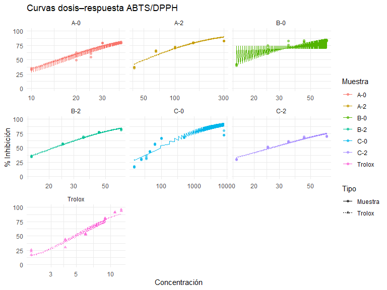
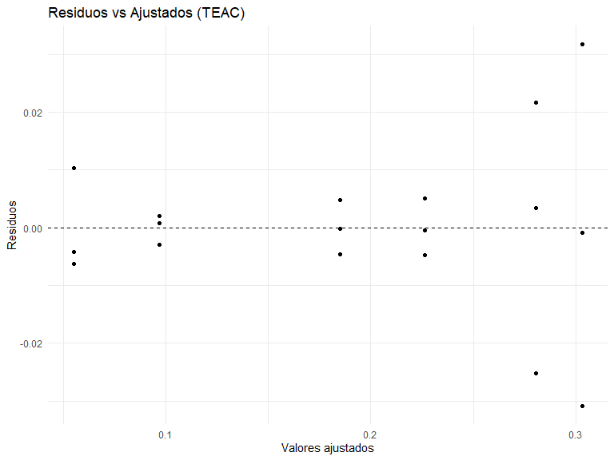
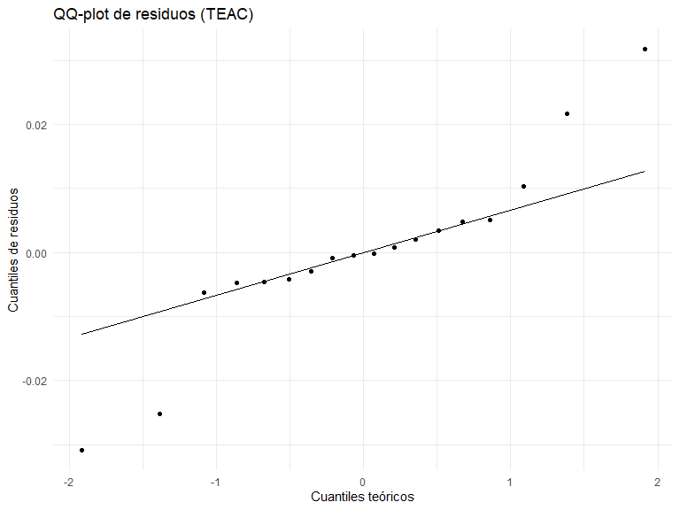
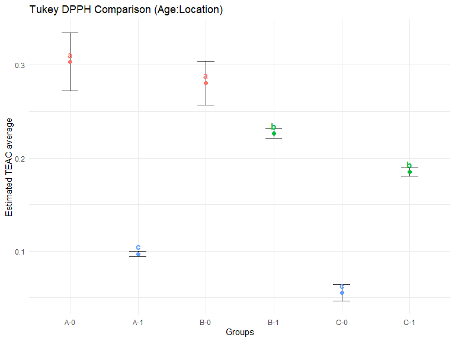

Actividad antioxidante ABTS/DPPH en *Ilex guayusa*
================
Gabriela Salazar, Thomas Garzón
2025-08-19

- [Introducción](#introducción)
- [Objetivo.](#objetivo)
- [Instalación y carga de paquetes](#instalación-y-carga-de-paquetes)
- [Definición de funciones del
  pipeline](#definición-de-funciones-del-pipeline)
  - [Porcentaje de inhibición (%PI)](#porcentaje-de-inhibición-pi)
  - [IC50](#ic50)
  - [TEAC](#teac)
  - [ANOVA](#anova)
  - [Graficas](#graficas)
  - [Llamar al pipeline](#llamar-al-pipeline)
- [Lectura de datos desde Excel](#lectura-de-datos-desde-excel)
  - [Preparación de datos para el pipeline
    ABTS/DPPH](#preparación-de-datos-para-el-pipeline-abtsdpph)
  - [Ejecución del pipeline](#ejecución-del-pipeline)
  - [Resultados de IC50](#resultados-de-ic50)
  - [Índice TEAC](#índice-teac)
  - [ANOVA y verificación de
    supuestos](#anova-y-verificación-de-supuestos)
  - [Comparaciones múltiples (Tukey)](#comparaciones-múltiples-tukey)
  - [Gráficos](#gráficos)
    - [(Opcional) Guardado de figuras a
      disco](#opcional-guardado-de-figuras-a-disco)

## Introducción

El presente trabajo se centra en evaluar la capacidad antioxidante de
muestras de Iles guayusa

Por otro lado, el codigo compila una variedad de formas y funciones para
calcular dferentes datos que ayudaran a observar un grafico de tukey que
aportara la diferencia que hay por meustra.

## Objetivo.

Procesar datos de actividad antioxidante para: %PI → IC50 → TEAC, luego
ANOVA (ubicación×edad) y Tukey, con gráficos de diagnóstico.

Entrada esperada. Un Excel con columnas: type (“Trolox” o “Muestra”), ID
(→ sample_id), ubicacion, edad, “conc” (concentración \> 0), A0 (blanco
ABTS/DPPH+agua), Aprime (muestra/trolox+agua), A1, A2, A3 (réplicas de
absorbancia de muestra/trolox+ABTS/DPPH). Si tus nombres cambian, ajusta
la sección **Lectura de datos**.

Salida. Tablas de IC50, TEAC, ANOVA/supuestos, resultados de Tukey y
figuras.

## Instalación y carga de paquetes

Verifica e instala librerías y luego las carga.

``` r
# Lista de paquetes requeridos para el análisis.  Si alguno no está
# instalado en su entorno, se instalará automáticamente.  Se han
# eliminado paquetes que no se utilizan en esta versión simplificada
# del pipeline (por ejemplo, `drc` y `ggpubr`).
required_packages <- c(
  "tidyverse",
  "minpack.lm",
  "car",
  "emmeans",
  "multcomp",
  "multcompView",
  "broom",
  "ggplot2",
  "agricolae",
  "readxl"
)
to_install <- setdiff(required_packages, rownames(installed.packages()))
if (length(to_install) > 0) {
  install.packages(to_install)
}
lapply(required_packages, require, character.only = TRUE)
```

    ## [[1]]
    ## [1] TRUE
    ## 
    ## [[2]]
    ## [1] TRUE
    ## 
    ## [[3]]
    ## [1] TRUE
    ## 
    ## [[4]]
    ## [1] TRUE
    ## 
    ## [[5]]
    ## [1] TRUE
    ## 
    ## [[6]]
    ## [1] TRUE
    ## 
    ## [[7]]
    ## [1] TRUE
    ## 
    ## [[8]]
    ## [1] TRUE
    ## 
    ## [[9]]
    ## [1] TRUE
    ## 
    ## [[10]]
    ## [1] TRUE

## Definición de funciones del pipeline

Propósito. Se realizan las formulas en el mismo scrip de Rmd para no
tener información faltante.

Consejo. Si la curva no ajusta, revisa que “conc” tenga suficientes
niveles (\>4) y que existan respuestas intermedias (0–100%).

### Porcentaje de inhibición (%PI)

Calcular %PI solo en casos válidos, usando la fórmula:

      %PI = (1 - ((A - A′) / A0)) * 100
      donde:
         A  = muestra + radical
         A′ = muestra + agua
         A0 = radical + agua (blanco)

``` r
# Función para calcular el porcentaje de inhibición (%PI) en ensayos antioxidantes
calc_percent_inhibition <- function(A, Aprime, A0) {
  
  # 1. Crear un filtro lógico de casos válidos:
  #    - Ningún valor faltante (NA)
  #    - A0 mayor que cero (evita división por 0)
  valid <- !is.na(A) & !is.na(Aprime) & !is.na(A0) & A0 > 0
  
  # 2. Inicializar un vector vacío (NA) de la misma longitud que A
  percent_raw <- rep(NA_real_, length(A))
  
  # 3. Calcular %PI solo en casos válidos, usando la fórmula:
  #    %PI = (1 - ((A - A′) / A0)) * 100
  #    donde:
  #       A  = muestra + radical
  #       A′ = muestra + agua
  #       A0 = radical + agua (blanco)
  percent_raw[valid] <- (1 - ((A[valid] - Aprime[valid]) / A0[valid])) * 100
  
  # 4. Truncar resultados al rango válido (0–100 %)
  #    - pmax(..., 0) asegura que valores < 0 se fijen en 0
  #    - pmin(..., 100) asegura que valores > 100 se fijen en 100
  percent_trunc <- pmin(pmax(percent_raw, 0), 100)
  
  # 5. Devolver un tibble con la columna "percent"
  tibble(percent = percent_trunc)
}
```

### IC50

Propósito: Ajustar una curva dosis–respuesta logística de 4 parámetros
con asintotas fijadas en 0 y 100 (modelo TOP = 100, BOTTOM = 0) para
estimar IC50.

Modelo (forma log-logística): y(x) = 100 / (1 + exp( b \* (log(x) -
log(e)) )) donde: - y = % de inhibición promedio (mean_pi), esperado en
\[0, 100\] - x = concentración positiva (conc \> 0) - b = pendiente
(positivo: curva decreciente; negativo: creciente) - e = IC50
(concentración a la que y = 50)

Entradas esperadas: - data_subset: data.frame/tibble con columnas: \*
mean_pi : numérico (0–100 idealmente), puede contener NA \* conc :
numérico \> 0, con al menos 5 valores únicos para ajuste robusto

Dependencias: - dplyr (para filter(), n_distinct()) - minpack.lm (para
nlsLM())

Salida: - list con elementos: ic50, ic50_lower, ic50_upper (numéricos;
NA si no se pudo estimar) method = “nlsLM” status ∈ {“ok”,
“pocos_puntos”, “fallo_ajuste”}

``` r
fit_ic50_one <- function(data_subset) {
  # 1) Limpieza
  data <- data_subset %>%
    dplyr::filter(!is.na(mean_pi), conc > 0) %>%
    dplyr::arrange(conc)

  if (dplyr::n_distinct(data$conc) < 5) {
    return(list(ic50 = NA_real_, ic50_lower = NA_real_, ic50_upper = NA_real_,
                method = "nlsLM", status = "pocos_puntos"))
  }

  # 2) Monotonicidad (permite ↑ o ↓)
  diffs <- diff(data$mean_pi)
  es_monotona <- all(diffs >= 0, na.rm = TRUE) || all(diffs <= 0, na.rm = TRUE)
  if (!es_monotona) {
    return(list(ic50 = NA_real_, ic50_lower = NA_real_, ic50_upper = NA_real_,
                method = "nlsLM", status = "no_monotona"))
  }

  # 3) Cobertura del 50% en el rango observado (evita extrapolar)
  rango <- range(data$mean_pi, na.rm = TRUE)
  cubre50 <- (min(rango) <= 50) && (50 <= max(rango))
  if (!cubre50) {
    return(list(ic50 = NA_real_, ic50_lower = NA_real_, ic50_upper = NA_real_,
                method = "nlsLM", status = "sin_cobertura"))
  }

  # 4) Modelo log-logístico con TOP=100, BOTTOM=0
  logistic_fun <- function(x, b, e) 100 / (1 + exp(b * (log(x) - log(e))))

  # 5) Inicios y cotas: e>0; b acotado (evita explosiones numéricas)
  start_vals <- list(b = if (diffs[1] < 0)  1 else -1,  # signo según tendencia
                     e = stats::median(data$conc, na.rm = TRUE))

  # b en [-10, 10] (ajústalo si tus curvas son más abruptas); e en (0, Inf)
  fit <- try(
    minpack.lm::nlsLM(mean_pi ~ logistic_fun(conc, b, e),
                      data = data,
                      start = start_vals,
                      lower = c(-10, 0),
                      upper = c( 10, Inf),
                      control = minpack.lm::nls.lm.control(maxiter = 200)),
    silent = TRUE
  )

  if (inherits(fit, "try-error")) {
    return(list(ic50 = NA_real_, ic50_lower = NA_real_, ic50_upper = NA_real_,
                method = "nlsLM", status = "fallo_ajuste"))
  }

  ic50_est <- unname(stats::coef(fit)["e"])

  # 6) Intervalos (si son estables)
  ci <- try(suppressMessages(stats::confint(fit)), silent = TRUE)
  ic50_lower <- ic50_upper <- NA_real_
  if (!inherits(ci, "try-error") && "e" %in% rownames(ci)) {
    ic50_lower <- ci["e", 1]; ic50_upper <- ci["e", 2]
  }

  list(ic50 = ic50_est, ic50_lower = ic50_lower, ic50_upper = ic50_upper,
       method = "nlsLM", status = "ok")
}
```

### TEAC

Propósito: Calcular el índice TEAC (Trolox Equivalent Antioxidant
Capacity) para cada muestra a partir de una tabla con IC50 ya estimados.
Se usa Trolox como patrón de referencia:

                    TEAC = IC50_Trolox_promedio / IC50_muestra.

Definición: - TEAC \> 1 → la muestra aparenta ser más potente que el
Trolox (IC50 menor). - TEAC = 1 → potencia equivalente a Trolox. - TEAC
\< 1 → la muestra es menos potente que Trolox (IC50 mayor).

Entradas esperadas (ic50_tbl: data.frame/tibble): Columnas mínimas: \*
type : factor/char (e.g., “Trolox” o tipo de muestra) \* sample_id :
identificador de la muestra (char/factor) \* ubicacion : factor/char (si
aplica) \* edad : factor/char (si aplica) \* replicate : réplica
(num/char) \* ic50 : valor de IC50 numérico (\> 0 idealmente) \* status
: estado del ajuste (“ok” cuando el ajuste fue exitoso)

Salida: - list con dos elementos: trolox_stats : lista con media, sd y n
de los IC50 de Trolox válidos teac : tibble con columnas (type,
sample_id, ubicacion, edad, replicate, ic50, teac)

Notas: - Solo se consideran curvas con status == “ok” y ic50 no NA. - Se
promedia el IC50 de Trolox cuando hay múltiples curvas de Trolox
válidas. - Es responsabilidad previa asegurar que los IC50 estén en
unidades coherentes.

``` r
compute_teac <- function(ic50_tbl) {

  # 1) Filtrar únicamente las curvas válidas de Trolox:
  #    - type == "Trolox"
  #    - status == "ok" (ajuste exitoso)
  #    - ic50 no NA
  trolox_tbl <- ic50_tbl %>%
    dplyr::filter(type == "Trolox", status == "ok", !is.na(ic50))

  # 2) Validación: requerimos al menos una curva válida de Trolox
  if (nrow(trolox_tbl) == 0) {
    stop("No se encontraron curvas válidas de Trolox para calcular TEAC.")
  }

  # 3) Estadísticos de Trolox (para documentar y/o propagar incertidumbre):
  ic50_trolox_mean <- mean(trolox_tbl$ic50, na.rm = TRUE)  # media IC50 Trolox
  ic50_trolox_sd   <- stats::sd(trolox_tbl$ic50, na.rm = TRUE)   # sd IC50 Trolox
  ic50_trolox_n    <- nrow(trolox_tbl)                            # n de curvas
  trolox_stats <- list(mean = ic50_trolox_mean,
                       sd   = ic50_trolox_sd,
                       n    = ic50_trolox_n)

  # 4) Calcular TEAC para todas las muestras != Trolox con ajuste válido:
  #    TEAC = IC50_Trolox_promedio / IC50_muestra
  teac_tbl <- ic50_tbl %>%
    dplyr::filter(type != "Trolox", status == "ok", !is.na(ic50)) %>%
    dplyr::mutate(teac = ic50_trolox_mean / ic50) %>%
    dplyr::select(type, sample_id, ubicacion, edad, replicate, ic50, teac)

  # 5) Devolver lista con estadísticos del patrón y tabla TEAC por muestra
  list(
    trolox_stats = trolox_stats,
    teac         = teac_tbl
  )
}
```

### ANOVA

Propósito: Ejecutar un ANOVA factorial 3×2 sobre el índice TEAC con
interacción (ubicacion \* edad), evaluar supuestos (normalidad de
residuos y homogeneidad de varianzas) y, según corresponda, realizar
comparaciones múltiples tipo Tukey mediante emmeans. Devuelve un listado
con: - anova: tabla ANOVA (Type III) - supuestos: p-valores de
Shapiro–Wilk y Levene - tukey: contrastes pareados y letras compactas
(CLD) - model: objeto lm ajustado

Requisitos: - Columnas en df_teac: teac (numérico), ubicacion
(factor/char), edad (factor/char) - Paquetes: dplyr, car, broom,
emmeans, multcomp

Notas metodológicas: - Se usa Type III (car::Anova type=3) por la
presencia de la interacción. - Shapiro–Wilk sobre residuos del LM
(normalidad). - Levene con centro mediana (robusto) sobre residuos ~
interacción. - Si la interacción es significativa (p \< 0.05): se
comparan celdas de la interacción ubicacion:edad. Si no, se comparan
efectos principales por separado (ubicacion y edad).

``` r
run_anova_teac <- function(df_teac) {
  results <- list()

  # Factores explícitos
  df_teac <- df_teac %>%
    dplyr::mutate(
      ubicacion = factor(ubicacion),
      edad      = factor(edad)
    )

  # Modelo lineal (para ANOVA Type III y supuestos)
  lm_model <- stats::lm(teac ~ ubicacion * edad, data = df_teac)

  # ANOVA Type III (informativo)
  anova_res <- car::Anova(lm_model, type = 3) %>% broom::tidy()

  # Supuestos
  shapiro_p <- tryCatch(stats::shapiro.test(stats::resid(lm_model))$p.value,
                        error = function(e) NA_real_)
  levene_p  <- tryCatch(
    car::leveneTest(stats::resid(lm_model) ~ interaction(df_teac$ubicacion, df_teac$edad),
                    center = median)$`Pr(>F)`[1],
    error = function(e) NA_real_
  )

  # --- Tukey con agricolae ----------------------------------------------------
  # Para contrastes con interacción significativa, creamos el factor combinado:
  # "Age:Location" en ese orden, como solicitaste en el título del gráfico.
  df_teac <- df_teac %>%
    dplyr::mutate(group_AL = interaction(edad, ubicacion, sep = ":"))  # Age:Location

  # Valor-p de la interacción desde el Type III
  p_int <- anova_res %>%
    dplyr::filter(term == "ubicacion:edad") %>%
    dplyr::pull(p.value)
  p_int <- ifelse(length(p_int) == 0, NA_real_, p_int)

  # Estructura de salida para Tukey (agricolae)
  if (!is.na(p_int) && p_int < 0.05) {
    # Interacción significativa: ANOVA 1-factor sobre el factor combinado
    aov_int <- stats::aov(teac ~ group_AL, data = df_teac)
    hsdi    <- agricolae::HSD.test(aov_int, "group_AL", group = TRUE)

    tukey_res <- list(
      comparison_type = "interaction_AL",
      # Elementos de agricolae que usaremos para graficar:
      groups  = hsdi$groups,   # letras compactas por grupo
      means   = hsdi$means,    # medias y n por grupo
      HSDtest = hsdi           # objeto completo por si deseas inspeccionar
    )

  } else {
    # Sin interacción: efectos principales por separado
    # (usamos un modelo con ambos factores para coherencia con agricolae)
    aov_main <- stats::aov(teac ~ ubicacion + edad, data = df_teac)
    hsd_ub   <- agricolae::HSD.test(aov_main, "ubicacion", group = TRUE)
    hsd_ed   <- agricolae::HSD.test(aov_main, "edad",      group = TRUE)

    tukey_res <- list(
      comparison_type = "main_effects",
      ubicacion = list(groups = hsd_ub$groups, means = hsd_ub$means, HSDtest = hsd_ub),
      edad      = list(groups = hsd_ed$groups, means = hsd_ed$means, HSDtest = hsd_ed)
    )
  }

  # Empaquetar resultados
  results$anova <- anova_res
  results$supuestos <- tibble::tibble(
    test    = c("Shapiro-Wilk (normalidad residuos)", "Levene (homogeneidad varianzas)"),
    p.value = c(shapiro_p, levene_p)
  )
  results$tukey <- tukey_res
  results$model <- lm_model
  results
}
```

### Graficas

Propósito: Generar un conjunto de gráficos para ilustrar y diagnosticar
los análisis: 1) Curvas dosis–respuesta ajustadas por muestra. 2)
Gráficos diagnósticos del modelo lineal ANOVA (residuos vs ajustados,
QQ-plot). 3) Gráficos de comparaciones múltiples Tukey (interacción o
efectos principales).

Entradas: - raw_data : tabla con datos crudos de % inhibición (columnas:
type, sample_id, ubicacion, edad, replicate, conc, percent). - ic50_tbl
: tabla de IC50 (no se usa directamente aquí pero incluida por
consistencia de pipeline). - anova_results: lista de resultados de
run_anova_teac(), que contiene: \$model (lm ajustado) \$tukey
(contrastes y CLD de emmeans)

Salida: - lista plots con objetos ggplot: \$dose_response : curvas
dosis–respuesta ajustadas \$residuals_vs_fitted : residuos vs valores
ajustados \$qq_plot : QQ-plot de residuos \$tukey : gráfico de
comparaciones múltiples (según interacción o no)

Paquetes usados: dplyr, ggplot2, minpack.lm, emmeans, multcomp

``` r
make_plots <- function(raw_data, ic50_tbl, anova_results) {
  plots <- list()

  # --------------------------------------------------------------------
  # 1) Calcular medias por concentración y curva (agregar % inhibición)
  agg_data <- raw_data %>%
    dplyr::group_by(type, sample_id, ubicacion, edad, replicate, conc) %>%
    dplyr::summarise(mean_pi = mean(percent, na.rm = TRUE), .groups = "drop")

  # --------------------------------------------------------------------
  # 2) Predicciones de las curvas ajustadas
  #    Se identifica cada curva (type + sample_id + ubicación + edad + réplica)
  unique_curves <- agg_data %>%
    dplyr::select(type, sample_id, ubicacion, edad, replicate) %>%
    dplyr::distinct()

  curve_predictions <- list()
  for (i in seq_len(nrow(unique_curves))) {
    # Subconjunto de datos de esa curva
    curve_id <- unique_curves[i, ]
    subset_i <- agg_data %>%
      dplyr::semi_join(curve_id, by = c("type", "sample_id", "ubicacion", "edad", "replicate"))

    # Secuencia de concentraciones para predicciones (escala continua log10)
    conc_seq <- seq(min(subset_i$conc, na.rm = TRUE),
                    max(subset_i$conc, na.rm = TRUE),
                    length.out = 100)

    # Ajuste preliminar con fit_ic50_one() para comprobar validez
    fit <- fit_ic50_one(subset_i)
    pred_pi <- rep(NA_real_, length(conc_seq))

    if (!is.na(fit$ic50) && fit$status == "ok") {
      # Función logística 4 parámetros (TOP=100, BOTTOM=0)
      logistic_fun <- function(x, b, e) { 100 / (1 + exp(b * (log(x) - log(e)))) }

      # Datos válidos para el ajuste
      data_nls <- subset_i %>%
        dplyr::filter(!is.na(mean_pi), conc > 0)

      # Valores iniciales
      start_vals <- list(b = 1, e = median(data_nls$conc, na.rm = TRUE))

      # Ajuste con nlsLM
      fit_nls <- try(
        minpack.lm::nlsLM(mean_pi ~ logistic_fun(conc, b, e),
                          data = data_nls,
                          start = start_vals,
                          lower = c(-Inf, 0), upper = c(Inf, Inf),
                          control = minpack.lm::nls.lm.control(maxiter = 200)),
        silent = TRUE
      )

      # Extraer coeficientes y predecir si el ajuste fue exitoso
      if (!inherits(fit_nls, "try-error")) {
        coef_nls <- stats::coef(fit_nls)
        pred_pi <- logistic_fun(conc_seq, coef_nls["b"], coef_nls["e"])
      }
    }

    # Guardar predicciones en tibble
    curve_predictions[[i]] <- tibble::tibble(
      type = curve_id$type,
      sample_id = curve_id$sample_id,
      ubicacion = curve_id$ubicacion,
      edad = curve_id$edad,
      replicate = curve_id$replicate,
      conc = conc_seq,
      pred_pi = pred_pi
    )
  }

  curve_pred_df <- dplyr::bind_rows(curve_predictions)

  # --------------------------------------------------------------------
  # 3) Gráfico de curvas dosis–respuesta
  p_curves <- ggplot2::ggplot() +
    ggplot2::geom_point(data = agg_data,
                        ggplot2::aes(x = conc, y = mean_pi,
                                     colour = sample_id, shape = type),
                        alpha = 0.6) +
    ggplot2::geom_line(data = curve_pred_df,
                       ggplot2::aes(x = conc, y = pred_pi,
                                    colour = sample_id, linetype = type)) +
    ggplot2::scale_y_continuous("% Inhibición", limits = c(0, 100)) +
    ggplot2::scale_x_continuous("Concentración", trans = "log10") +
    ggplot2::labs(title = "Curvas dosis–respuesta ABTS/DPPH",
                  colour = "Muestra", shape = "Tipo", linetype = "Tipo") +
    ggplot2::theme_minimal() +
    ggplot2::facet_wrap(~ sample_id, scales = "free_x")
  plots$dose_response <- p_curves

  # --------------------------------------------------------------------
  # 4) Gráficos diagnósticos del modelo ANOVA
  lm_model <- anova_results$model
  df_res <- tibble::tibble(fitted = stats::fitted(lm_model),
                           resid  = stats::resid(lm_model))

  # Residuos vs ajustados
  p_res_fitted <- ggplot2::ggplot(df_res, ggplot2::aes(x = fitted, y = resid)) +
    ggplot2::geom_point() +
    ggplot2::geom_hline(yintercept = 0, linetype = 2) +
    ggplot2::labs(title = "Residuos vs Ajustados (TEAC)",
                  x = "Valores ajustados", y = "Residuos") +
    ggplot2::theme_minimal()

  # QQ-plot de residuos
  p_qq <- ggplot2::ggplot(df_res, ggplot2::aes(sample = resid)) +
    ggplot2::stat_qq() +
    ggplot2::stat_qq_line() +
    ggplot2::labs(title = "QQ-plot de residuos (TEAC)",
                  x = "Cuantiles teóricos", y = "Cuantiles de residuos") +
    ggplot2::theme_minimal()

  plots$residuals_vs_fitted <- p_res_fitted
  plots$qq_plot <- p_qq

  # --------------------------------------------------------------------
  # 5) Gráfico de comparaciones múltiples Tukey (agricolae::HSD.test)
  tukey_res <- anova_results$tukey

  # Mapeo de ubicación -> código (para etiquetas A/B/C)
  ub_map <- c("Talag" = "A", "Alto Pano" = "B", "Alto Tena" = "C")

  # Funciones auxiliares para rotular "Age:Location" -> "X-Y" (X=A/B/C, Y=0/1)
  recode_interaction_label <- function(x) {
    # x viene como "edad:ubicacion" (p.ej., "0:Talag")
    age <- sub("^([^:]+):.*$", "\\1", x)
    loc <- sub("^.*:([^:]+)$", "\\1", x)
    loc_code <- dplyr::recode(loc, !!!ub_map)
    paste0(loc_code, "-", age)
  }

  if (tukey_res$comparison_type == "interaction_AL") {
    # ---- Caso: interacción significativa (Age:Location) ----
    # 'groups' = letras de agrupamiento por nivel
    cld_tbl <- tukey_res$groups %>%
      tibble::rownames_to_column("group_AL") %>%
      dplyr::select(group_AL, groups) %>%
      dplyr::mutate(label = recode_interaction_label(group_AL))

    # 'means' = estadísticas por nivel (incluye 'means', 'std', 'r', etc. según la versión)
    means_tbl <- tukey_res$means %>%
      tibble::rownames_to_column("group_AL")

    # Detectar columna de media y de desviación estándar de manera robusta
    if ("means" %in% names(means_tbl)) {
      means_tbl <- dplyr::rename(means_tbl, mean_teac = means)
    } else if ("teac" %in% names(means_tbl)) {
      means_tbl <- dplyr::rename(means_tbl, mean_teac = teac)
    } else {
      cand <- setdiff(names(means_tbl), c("group_AL", "r", "Min", "Max", "Q25", "Q50", "Q75"))
      means_tbl$mean_teac <- means_tbl[[cand[1]]]
    }
    if (!("std" %in% names(means_tbl))) {
      means_tbl$std <- NA_real_   # si no está disponible, dejamos NA (sin barras)
    }

    df_plot <- cld_tbl %>%
      dplyr::left_join(means_tbl, by = "group_AL") %>%
      dplyr::mutate(
        ymin = mean_teac - std,
        ymax = mean_teac + std,
        # si std es NA, evitar error en las barras
        ymin = ifelse(is.na(std), NA_real_, ymin),
        ymax = ifelse(is.na(std), NA_real_, ymax)
      )

    p_tukey <- ggplot2::ggplot(df_plot, ggplot2::aes(x = label, y = mean_teac)) +
      # Barras de error ±SD (si existen)
      ggplot2::geom_errorbar(ggplot2::aes(ymin = ymin, ymax = ymax), width = 0.25, alpha = 0.8, na.rm = TRUE) +
      # Punto de la media (coloreado por la letra de agrupamiento)
      ggplot2::geom_point(ggplot2::aes(color = groups), size = 2) +
      # Letras de agrupamiento encima del punto (mismo color que el punto)
      ggplot2::geom_text(ggplot2::aes(label = groups, color = groups), vjust = -0.6, fontface = "bold") +
      ggplot2::labs(
        title = "Tukey DPPH Comparison (Age:Location)",
        x = "Groups",
        y = "Estimated TEAC average"
      ) +
      ggplot2::theme_minimal() +
      ggplot2::theme(
        axis.text.x = ggplot2::element_text(angle = 0, vjust = 0.8),
        legend.position = "none"  # ocultar leyenda: el color codifica la letra directamente
      )

    plots$tukey <- p_tukey

  } else {
    # ---- Caso: sin interacción -> efectos principales por separado ----
    # UBICACIÓN
    g1 <- tukey_res$ubicacion$groups %>%
      tibble::rownames_to_column("level") %>%
      dplyr::select(level, groups) %>%
      dplyr::mutate(label = dplyr::recode(level, !!!ub_map))
    m1 <- tukey_res$ubicacion$means %>% tibble::rownames_to_column("level")

    if ("means" %in% names(m1)) {
      m1 <- dplyr::rename(m1, mean_teac = means)
    } else if ("teac" %in% names(m1)) {
      m1 <- dplyr::rename(m1, mean_teac = teac)
    } else {
      cand <- setdiff(names(m1), c("level", "r", "Min", "Max", "Q25", "Q50", "Q75"))
      m1$mean_teac <- m1[[cand[1]]]
    }
    if (!("std" %in% names(m1))) m1$std <- NA_real_

    df_ub <- g1 %>% dplyr::left_join(m1, by = "level") %>%
      dplyr::mutate(
        ymin = mean_teac - std,
        ymax = mean_teac + std,
        ymin = ifelse(is.na(std), NA_real_, ymin),
        ymax = ifelse(is.na(std), NA_real_, ymax),
        factor = "ubicacion"
      )

    # EDAD
    g2 <- tukey_res$edad$groups %>%
      tibble::rownames_to_column("level") %>%
      dplyr::select(level, groups) %>%
      dplyr::mutate(label = level)  # edad ya es 0/1
    m2 <- tukey_res$edad$means %>% tibble::rownames_to_column("level")

    if ("means" %in% names(m2)) {
      m2 <- dplyr::rename(m2, mean_teac = means)
    } else if ("teac" %in% names(m2)) {
      m2 <- dplyr::rename(m2, mean_teac = teac)
    } else {
      cand <- setdiff(names(m2), c("level", "r", "Min", "Max", "Q25", "Q50", "Q75"))
      m2$mean_teac <- m2[[cand[1]]]
    }
    if (!("std" %in% names(m2))) m2$std <- NA_real_

    df_ed <- g2 %>% dplyr::left_join(m2, by = "level") %>%
      dplyr::mutate(
        ymin = mean_teac - std,
        ymax = mean_teac + std,
        ymin = ifelse(is.na(std), NA_real_, ymin),
        ymax = ifelse(is.na(std), NA_real_, ymax),
        factor = "edad"
      )

    df_all <- dplyr::bind_rows(df_ub, df_ed)

    p_tukey <- ggplot2::ggplot(df_all, ggplot2::aes(x = label, y = mean_teac)) +
      ggplot2::geom_errorbar(ggplot2::aes(ymin = ymin, ymax = ymax), width = 0.25, alpha = 0.8, na.rm = TRUE) +
      ggplot2::geom_point(ggplot2::aes(color = groups), size = 2) +
      ggplot2::geom_text(ggplot2::aes(label = groups, color = groups), vjust = -0.6, fontface = "bold") +
      ggplot2::facet_wrap(~ factor, scales = "free_x") +
      ggplot2::labs(
        title = "Tukey DPPH Comparison (Age:Location)",
        x = "Groups",
        y = "Estimated TEAC average"
      ) +
      ggplot2::theme_minimal() +
      ggplot2::theme(legend.position = "none")

    plots$tukey <- p_tukey
  }

  # --------------------------------------------------------------------
  plots
}
```

### Llamar al pipeline

Propósito: Pipeline simplificado para el ensayo actividad antioxidante:
(1) Leer datos crudos desde CSV (formato largo). (2) Calcular %PI por
registro. (3) Agregar por curva (concentración) para obtener mean_pi.
(4) Ajustar curvas log-logísticas y estimar IC50 por curva. (5) Estimar
IC50 de referencia (Trolox) y calcular TEAC por muestra. (6) Ejecutar
ANOVA factorial 3×2 (ubicación × edad) sobre TEAC. (7) Generar gráficos
diagnósticos y de comparaciones.

Entradas: - path_to_csv: ruta al archivo CSV con columnas mínimas: type,
sample_id, ubicacion, edad, conc, A, Aprime, A0, replicate

Dependencias (upstream): - calc_percent_inhibition(), fit_ic50_one(),
compute_teac(), run_anova_teac(), make_plots() - Paquetes: readr, dplyr,
tibble, broom, car, emmeans, multcomp, ggplot2, minpack.lm

Salida: - list con: \$ic50_series : tabla de IC50 por curva (con estado
del ajuste) \$ic50_trolox : resumen (media, sd, n) de IC50 de Trolox
\$teac_table : tabla TEAC por muestra (no Trolox) \$anova : tabla ANOVA
(Type III) \$supuestos : p-valores de Shapiro y Levene \$tukey : objeto
con contrastes/CLD según interacción o efectos principales \$plots :
lista de gráficos (curvas, diagnósticos, Tukey)

``` r
run_abts_pipeline <- function(path_to_csv) {
  set.seed(123)  # Fijar semilla para reproducibilidad en procesos aleatorizados (si aplica)

  # 1) Lectura segura del CSV (col_types = cols() deja inferencia controlada)
  raw_df <- readr::read_csv(path_to_csv, col_types = readr::cols())

  # 2) Validación de columnas requeridas
  required_cols <- c("type", "sample_id", "ubicacion", "edad", "conc",
                     "A", "Aprime", "A0", "replicate")
  missing_cols <- setdiff(required_cols, names(raw_df))
  if (length(missing_cols) > 0) {
    stop(paste("Faltan las columnas:", paste(missing_cols, collapse = ", ")))
  }

  # 3) Coerción de tipos (defensiva) para evitar sorpresas por lectura
  df <- raw_df %>%
    dplyr::mutate(
      type      = as.character(type),
      sample_id = as.character(sample_id),
      ubicacion = as.character(ubicacion),
      edad      = as.character(edad),
      conc      = as.numeric(conc),
      A         = as.numeric(A),
      Aprime    = as.numeric(Aprime),
      A0        = as.numeric(A0),
      replicate = as.integer(replicate)
    )

  # 4) Filtrado básico de calidad: remover registros con A0 inválido (NA o ≤ 0)
  df <- df %>% dplyr::filter(!is.na(A0) & A0 > 0)

  # 5) Calcular %PI por registro y anexar al data frame
  #    %PI = (1 - ((A - A')/A0)) * 100, truncado a [0, 100]
  pi_tbl <- calc_percent_inhibition(df$A, df$Aprime, df$A0)
  df <- dplyr::bind_cols(df, pi_tbl)

  # 6) Agregación por curva y concentración:
  #    mean_pi = promedio de %PI por (type, sample_id, ubicacion, edad, replicate, conc)
  summary_df <- df %>%
    dplyr::group_by(type, sample_id, ubicacion, edad, replicate, conc) %>%
    dplyr::summarise(mean_pi = mean(percent, na.rm = TRUE), .groups = "drop")

  # 7) Ajuste de curvas e IC50 por curva
  #    Se identifican las curvas (combinación única sin 'conc')
  curve_ids <- summary_df %>%
    dplyr::select(type, sample_id, ubicacion, edad, replicate) %>%
    dplyr::distinct()

  ic50_list <- list()
  for (i in seq_len(nrow(curve_ids))) {
    # Subconjunto de una curva específica ordenado por concentración
    cid <- curve_ids[i, ]
    subset_i <- summary_df %>%
      dplyr::semi_join(cid, by = c("type", "sample_id", "ubicacion", "edad", "replicate")) %>%
      dplyr::arrange(conc)

    # Ajuste log-logístico con nlsLM (TOP=100, BOTTOM=0) vía fit_ic50_one()
    fit_res <- fit_ic50_one(subset_i)

    # Empaquetar resultados (incluye IC50 puntual e ICIs si disponibles)
    ic50_list[[i]] <- cid %>%
      dplyr::mutate(
        ic50     = fit_res$ic50,
        ic50_low = fit_res$ic50_lower,
        ic50_up  = fit_res$ic50_upper,
        method   = fit_res$method,
        status   = fit_res$status
      )
  }
  ic50_tbl <- dplyr::bind_rows(ic50_list)

  # 8) Cálculo de TEAC (Trolox Equivalent Antioxidant Capacity)
  #    - promedia IC50 de Trolox (curvas válidas) y computa TEAC = IC50_Trolox / IC50_muestra
  teac_res <- compute_teac(ic50_tbl)
  ic50_trolox_mean <- teac_res$trolox_stats$mean
  df_teac <- teac_res$teac

  # 9) ANOVA factorial 3×2 sobre TEAC y comparaciones múltiples
  anova_results <- run_anova_teac(df_teac)

  # 10) Gráficos: curvas, diagnósticos del LM y Tukey (según interacción/efectos)
  plots <- make_plots(df, ic50_tbl, anova_results)

  # 11) Salida final del pipeline
  list(
    ic50_series   = ic50_tbl,  # IC50 por curva con estado del ajuste
    ic50_trolox   = tibble::tibble(
      ic50_trolox_mean = ic50_trolox_mean,
      ic50_trolox_sd   = teac_res$trolox_stats$sd,
      ic50_trolox_n    = teac_res$trolox_stats$n
    ),
    teac_table    = df_teac,            # TEAC por muestra (excluye Trolox)
    anova         = anova_results$anova,
    supuestos     = anova_results$supuestos,
    tukey         = anova_results$tukey,
    plots         = plots               # lista de ggplots
  )
}
```

# Lectura de datos desde Excel

## Preparación de datos para el pipeline ABTS/DPPH

Propósito: - Verificar la existencia del archivo Excel fuente. - Leer la
hoja principal y transformar los datos a formato largo (tidy), generando
una fila por réplica (A1, A2, A3 → filas). - Estandarizar nombres y
tipos de columna según lo esperado por el pipeline. - Guardar un CSV
temporal listo para ser consumido por run_abts_pipeline().

Requisitos: - Paquetes: readxl, dplyr, tidyr, readr - Estructura mínima
del Excel: \* ID (identificador de muestra) → renombrado a sample_id \*
type, ubicacion, edad \* conc (concentración) \* A0, Aprime (controles
por concentración) \* A1, A2, A3 (absorbancias por réplica)

``` r
# 1) Ruta al archivo Excel. Ajuste la ruta/nombre si es necesario.
ppath <- "../ANOVA"
path_excel <- "../Data/Antioxidante_gaby_tidy.xlsx"

# 2) Comprobación defensiva: existencia del archivo
if (!file.exists(path_excel)) {
  stop(paste("No se encontró el archivo:", path_excel))
}

# 3) Lectura del Excel
#    - Si hay múltiples hojas, especifique en read_excel(sheet = "nombre_hoja" o índice)
raw_data <- readxl::read_excel(path_excel)
#   Sugerencia: validar nombres de columnas aquí si la fuente varía entre archivos.

# 4) Transformación a formato largo (tidy)
#    - En el archivo original, A1, A2 y A3 son las réplicas de absorbancia (A).
#    - Aprime y A0 son únicos por concentración.
#    - Se pivotan A1:A3 a filas y se extrae el índice de réplica con names_pattern.
raw_long <- raw_data %>%
  dplyr::rename(sample_id = ID) %>%            # Estándar esperado por el pipeline
  tidyr::pivot_longer(
    cols = c("A1", "A2", "A3"),                # Columnas de réplicas
    names_to = "replicate",                    # Nueva columna: índice de réplica
    values_to = "A",                           # Nueva columna: absorbancia
    names_pattern = "A(\\d)"                   # Extrae 1, 2, 3 desde "A1", "A2", "A3"
  ) %>%
  dplyr::mutate(
    replicate = as.integer(replicate),         # Índice de réplica como entero
    type      = as.character(type),
    ubicacion = as.character(ubicacion),
    edad      = as.character(edad)
  ) %>%
  # 5) Seleccionar y ordenar columnas según la interfaz del pipeline
  #    (usar dplyr::select para evitar choques con select() de otros paquetes)
  dplyr::select(type, sample_id, ubicacion, edad, conc, A0, Aprime, A, replicate)

# 6) Filtrado de calidad: eliminar filas sin absorbancia en la réplica
raw_long <- raw_long %>%
  dplyr::filter(!is.na(A))

# 7) Persistir en un CSV temporal para consumo por run_abts_pipeline()
#    - Motivo: el pipeline lee desde CSV y este paso garantiza estructura/tipos.
# Guardar CSV listo para el pipeline en la carpeta Outputs (junto al .Rmd)
temp_csv <- file.path(OUTPUTS_DIR, "abts_input_long.csv")
readr::write_csv(raw_long, temp_csv)

message("Datos transformados y guardados en: ", temp_csv)
```

## Ejecución del pipeline

Una vez que los datos se han convertido a un archivo CSV temporal, se
invoca la función `run_abts_pipeline()` definida en este mismo cuaderno.
Esta función reúne todo el flujo de trabajo: calcula el porcentaje de
inhibición, ajusta las curvas dosis–respuesta, estima los IC50, calcula
el índice TEAC, realiza un ANOVA factorial y genera las gráficas de
diagnóstico y comparación. Si desea modificar algún componente del
análisis (por ejemplo, ajustar sólo determinadas muestras o cambiar el
modelo estadístico), edite la definición de `run_abts_pipeline()` en la
sección de funciones y vuelva a ejecutar las celdas correspondientes.

``` r
# Ejecutar el pipeline con el archivo CSV temporal.  El resultado es
# una lista con tablas, resultados estadísticos y gráficos.
resultados <- run_abts_pipeline(temp_csv)
```

``` r
if (!exists("resultados") || !is.list(resultados)) {
  stop("No se encontró el objeto 'resultados'. Asegúrate de ejecutar la celda 'run-pipeline' sin errores.")
}

# 1) IC50 por curva
readr::write_csv(resultados$ic50_series, file.path(OUTPUTS_DIR, "IC50_series.csv"))

# 2) Estadísticos de Trolox
readr::write_csv(resultados$ic50_trolox, file.path(OUTPUTS_DIR, "IC50_Trolox_summary.csv"))

# 3) Tabla TEAC
readr::write_csv(resultados$teac_table, file.path(OUTPUTS_DIR, "TEAC_table.csv"))

# 4) ANOVA y supuestos
readr::write_csv(resultados$anova,     file.path(OUTPUTS_DIR, "ANOVA_TypeIII.csv"))
readr::write_csv(resultados$supuestos, file.path(OUTPUTS_DIR, "ANOVA_assumptions.csv"))
```

## Resultados de IC50

``` r
# Tabla detallada de IC50 por curva
dplyr::glimpse(resultados$ic50_series)
```

    ## Rows: 21
    ## Columns: 10
    ## $ type      <chr> "Muestra", "Muestra", "Muestra", "Muestra", "Muestra", "Mues…
    ## $ sample_id <chr> "A-0", "A-0", "A-0", "A-2", "A-2", "A-2", "B-0", "B-0", "B-0…
    ## $ ubicacion <chr> "Talag", "Talag", "Talag", "Talag", "Talag", "Talag", "Alto …
    ## $ edad      <chr> "0", "0", "0", "1", "1", "1", "0", "0", "0", "1", "1", "1", …
    ## $ replicate <int> 1, 2, 3, 1, 2, 3, 1, 2, 3, 1, 2, 3, 1, 2, 3, 1, 2, 3, 1, 2, 3
    ## $ ic50      <dbl> 14.549497, 17.898687, 16.122964, 49.265072, 49.893780, 51.93…
    ## $ ic50_low  <dbl> 11.752737, NA, 10.546729, 13.135915, 13.362629, 16.120776, 1…
    ## $ ic50_up   <dbl> 16.998266, NA, 20.595941, 73.264437, 74.578584, 77.026188, 2…
    ## $ method    <chr> "nlsLM", "nlsLM", "nlsLM", "nlsLM", "nlsLM", "nlsLM", "nlsLM…
    ## $ status    <chr> "ok", "ok", "ok", "ok", "ok", "ok", "ok", "ok", "ok", "ok", …

``` r
# Estadísticas del IC50 promedio de Trolox
resultados$ic50_trolox
```

    ## # A tibble: 1 × 3
    ##   ic50_trolox_mean ic50_trolox_sd ic50_trolox_n
    ##              <dbl>          <dbl>         <int>
    ## 1             4.88          0.290             3

## Índice TEAC

``` r
# Tabla TEAC para cada muestra
resultados$teac_table
```

    ## # A tibble: 18 × 7
    ##    type    sample_id ubicacion edad  replicate  ic50   teac
    ##    <chr>   <chr>     <chr>     <chr>     <int> <dbl>  <dbl>
    ##  1 Muestra A-0       Talag     0             1  14.5 0.335 
    ##  2 Muestra A-0       Talag     0             2  17.9 0.272 
    ##  3 Muestra A-0       Talag     0             3  16.1 0.302 
    ##  4 Muestra A-2       Talag     1             1  49.3 0.0990
    ##  5 Muestra A-2       Talag     1             2  49.9 0.0977
    ##  6 Muestra A-2       Talag     1             3  51.9 0.0939
    ##  7 Muestra B-0       Alto Pano 0             1  19.1 0.256 
    ##  8 Muestra B-0       Alto Pano 0             2  16.1 0.302 
    ##  9 Muestra B-0       Alto Pano 0             3  17.2 0.284 
    ## 10 Muestra B-2       Alto Pano 1             1  22.0 0.222 
    ## 11 Muestra B-2       Alto Pano 1             2  21.6 0.226 
    ## 12 Muestra B-2       Alto Pano 1             3  21.1 0.232 
    ## 13 Muestra C-0       Alto Tena 0             1  99.7 0.0489
    ## 14 Muestra C-0       Alto Tena 0             2  95.6 0.0510
    ## 15 Muestra C-0       Alto Tena 0             3  74.5 0.0654
    ## 16 Muestra C-2       Alto Tena 1             1  26.4 0.185 
    ## 17 Muestra C-2       Alto Tena 1             2  27.0 0.180 
    ## 18 Muestra C-2       Alto Tena 1             3  25.7 0.190

## ANOVA y verificación de supuestos

``` r
# Resumen de ANOVA (modelo original y, si corresponde, transformado)
resultados$anova
```

    ## # A tibble: 5 × 5
    ##   term             sumsq    df statistic   p.value
    ##   <chr>            <dbl> <dbl>     <dbl>     <dbl>
    ## 1 (Intercept)    0.236       1     847.   1.69e-12
    ## 2 ubicacion      0.113       2     202.   5.70e-10
    ## 3 edad           0.00443     1      15.8  1.82e- 3
    ## 4 ubicacion:edad 0.0852      2     152.   2.95e- 9
    ## 5 Residuals      0.00335    12      NA   NA

``` r
# Pruebas de normalidad y homocedasticidad
resultados$supuestos
```

    ## # A tibble: 2 × 2
    ##   test                               p.value
    ##   <chr>                                <dbl>
    ## 1 Shapiro-Wilk (normalidad residuos)  0.0650
    ## 2 Levene (homogeneidad varianzas)     0.181

## Comparaciones múltiples (Tukey)

``` r
# Resultados de comparaciones múltiples según la existencia de interacción
resultados$tukey
```

    ## $comparison_type
    ## [1] "interaction_AL"
    ## 
    ## $groups
    ##                   teac groups
    ## 0:Talag     0.30338275      a
    ## 0:Alto Pano 0.28074312      a
    ## 1:Alto Pano 0.22642038      b
    ## 1:Alto Tena 0.18505082      b
    ## 1:Talag     0.09688030      c
    ## 0:Alto Tena 0.05511335      c
    ## 
    ## $means
    ##                   teac         std r          se        Min        Max
    ## 0:Alto Pano 0.28074312 0.023610119 3 0.009648967 0.25558158 0.30241291
    ## 0:Alto Tena 0.05511335 0.008999583 3 0.009648967 0.04890119 0.06543395
    ## 0:Talag     0.30338275 0.031370331 3 0.009648967 0.27247263 0.33519388
    ## 1:Alto Pano 0.22642038 0.004915751 3 0.009648967 0.22175012 0.23154945
    ## 1:Alto Tena 0.18505082 0.004702388 3 0.009648967 0.18045049 0.18984902
    ## 1:Talag     0.09688030 0.002653531 3 0.009648967 0.09390211 0.09899310
    ##                    Q25       Q50        Q75
    ## 0:Alto Pano 0.26990822 0.2842349 0.29332389
    ## 0:Alto Tena 0.04995305 0.0510049 0.05821942
    ## 0:Talag     0.28747719 0.3024818 0.31883782
    ## 1:Alto Pano 0.22385584 0.2259616 0.22875551
    ## 1:Alto Tena 0.18265171 0.1848529 0.18735098
    ## 1:Talag     0.09582390 0.0977457 0.09836940
    ## 
    ## $HSDtest
    ## $statistics
    ##        MSerror Df      Mean       CV        MSD
    ##   0.0002793077 12 0.1912651 8.737872 0.04583483
    ## 
    ## $parameters
    ##    test   name.t ntr StudentizedRange alpha
    ##   Tukey group_AL   6         4.750231  0.05
    ## 
    ## $means
    ##                   teac         std r          se        Min        Max
    ## 0:Alto Pano 0.28074312 0.023610119 3 0.009648967 0.25558158 0.30241291
    ## 0:Alto Tena 0.05511335 0.008999583 3 0.009648967 0.04890119 0.06543395
    ## 0:Talag     0.30338275 0.031370331 3 0.009648967 0.27247263 0.33519388
    ## 1:Alto Pano 0.22642038 0.004915751 3 0.009648967 0.22175012 0.23154945
    ## 1:Alto Tena 0.18505082 0.004702388 3 0.009648967 0.18045049 0.18984902
    ## 1:Talag     0.09688030 0.002653531 3 0.009648967 0.09390211 0.09899310
    ##                    Q25       Q50        Q75
    ## 0:Alto Pano 0.26990822 0.2842349 0.29332389
    ## 0:Alto Tena 0.04995305 0.0510049 0.05821942
    ## 0:Talag     0.28747719 0.3024818 0.31883782
    ## 1:Alto Pano 0.22385584 0.2259616 0.22875551
    ## 1:Alto Tena 0.18265171 0.1848529 0.18735098
    ## 1:Talag     0.09582390 0.0977457 0.09836940
    ## 
    ## $comparison
    ## NULL
    ## 
    ## $groups
    ##                   teac groups
    ## 0:Talag     0.30338275      a
    ## 0:Alto Pano 0.28074312      a
    ## 1:Alto Pano 0.22642038      b
    ## 1:Alto Tena 0.18505082      b
    ## 1:Talag     0.09688030      c
    ## 0:Alto Tena 0.05511335      c
    ## 
    ## attr(,"class")
    ## [1] "group"

## Gráficos

``` r
# Curvas dosis–respuesta con ajustes
print(resultados$plots$dose_response)
```

<!-- -->

``` r
# Diagnóstico del modelo: residuos vs ajustados
print(resultados$plots$residuals_vs_fitted)
```

<!-- -->

``` r
# Diagnóstico del modelo: QQ-plot de residuos
print(resultados$plots$qq_plot)
```

<!-- -->

``` r
# Comparaciones tipo Tukey con letras de agrupamiento
print(resultados$plots$tukey)
```

<!-- -->

### (Opcional) Guardado de figuras a disco

Para exportar las figuras con calidad de publicación:

``` r
# Ejemplos de guardado (modifique nombres y tamaños según su caso)
ggplot2::ggsave("01_curvas_dosis_respuesta.pdf", resultados$plots$dose_response,
                width = 10, height = 7, units = "in", dpi = 300)
ggplot2::ggsave("02_residuos_vs_ajustados.png", resultados$plots$residuals_vs_fitted,
                width = 7, height = 5, units = "in", dpi = 300)
ggplot2::ggsave("03_qqplot_residuos.png", resultados$plots$qq_plot,
                width = 7, height = 5, units = "in", dpi = 300)
ggplot2::ggsave("04_tukey_cld.pdf", resultados$plots$tukey,
                width = 8, height = 6, units = "in", dpi = 300)
```
