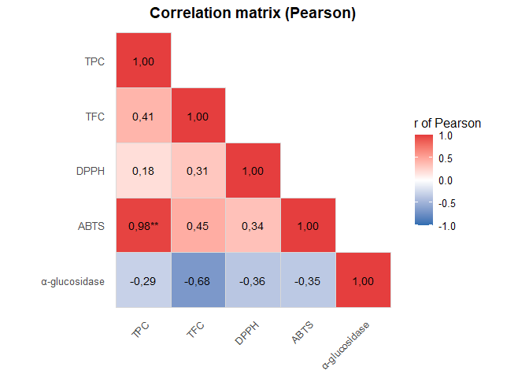
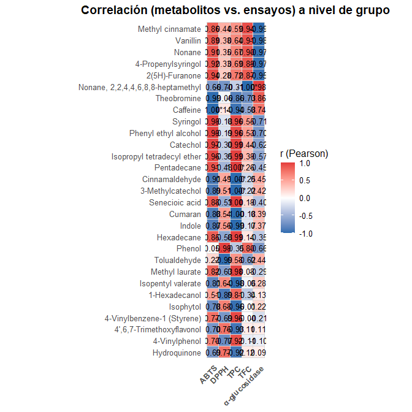
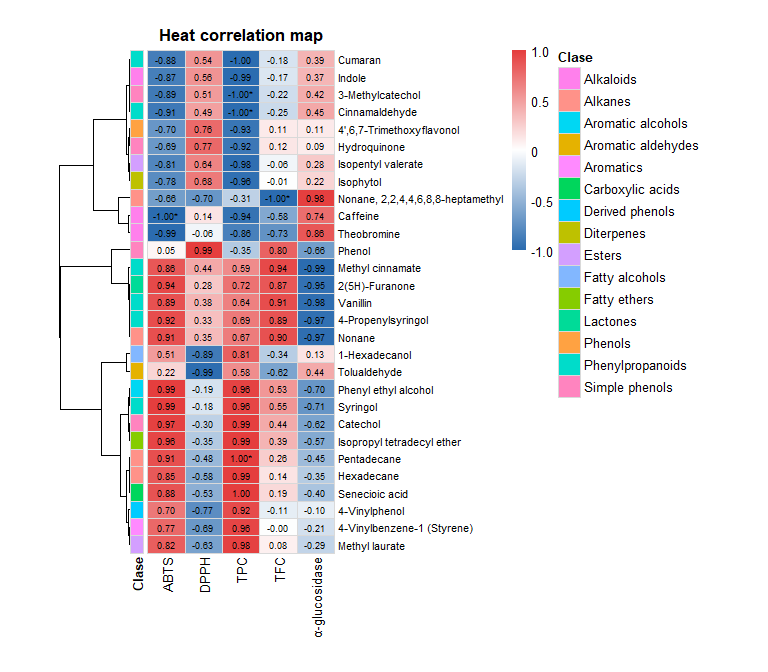
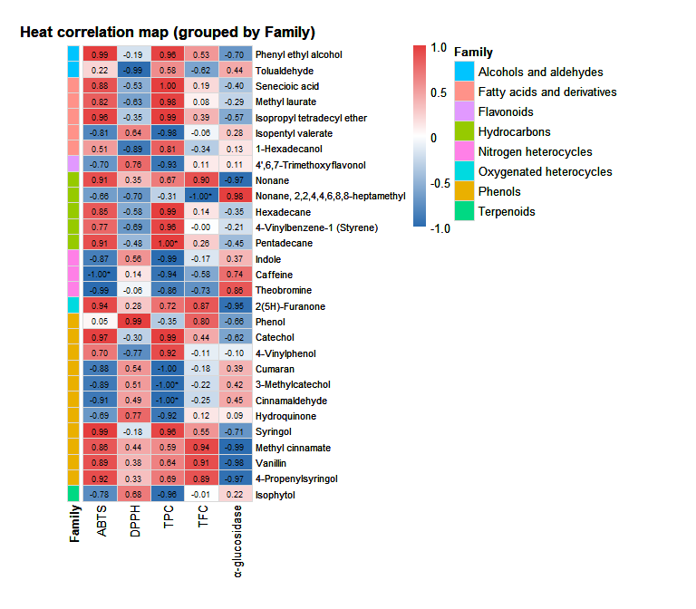
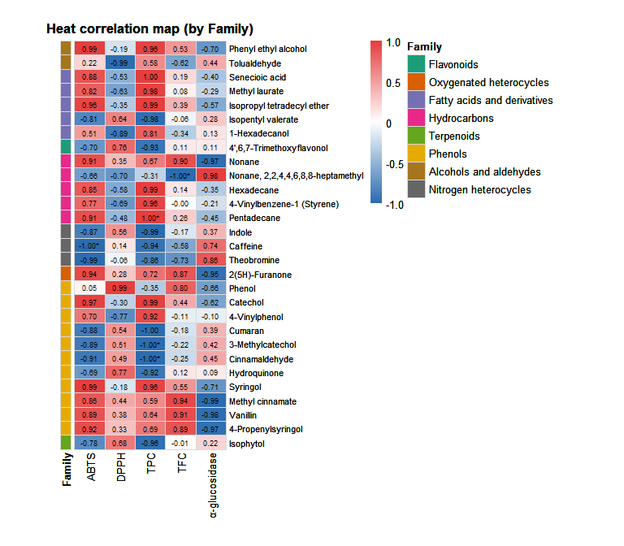

Pearson correlasión de antioxidante con cuantificación en ilex guayusa\*
================
Gabriela Salazar, Thomas Garzón
2025-08-19

- [Introducción](#introducción)
- [Objetivos](#objetivos)
- [Cálculo básico de Pearson
  (ensayos)](#cálculo-básico-de-pearson-ensayos)
- [Heatmap simple de correlaciones entre
  ensayos](#heatmap-simple-de-correlaciones-entre-ensayos)
- [Metabolites](#metabolites)
  - [Paquetes para la sección de
    metabolitos](#paquetes-para-la-sección-de-metabolitos)
  - [Lectura de datos (metabolitos y
    ensayos)](#lectura-de-datos-metabolitos-y-ensayos)
  - [Normalización de nombres y verificación de
    columnas](#normalización-de-nombres-y-verificación-de-columnas)
  - [Agregación: promedio por grupo de
    metabolitos](#agregación-promedio-por-grupo-de-metabolitos)
  - [Correlaciones metabolito–ensayo y heatmap (metabolitos ×
    ensayos)](#correlaciones-metabolitoensayo-y-heatmap-metabolitos--ensayos)
  - [Heatmap con pheatmap y anotación por
    Clase](#heatmap-con-pheatmap-y-anotación-por-clase)
  - [Reordenación por Family y heatmap sin
    dendrogramas](#reordenación-por-family-y-heatmap-sin-dendrogramas)
- [Biplot](#biplot)
  - [Biplot de cargas (PCA) para ensayos vs
    metabolitos](#biplot-de-cargas-pca-para-ensayos-vs-metabolitos)

## Introducción

Este cuaderno cuantifica y visualiza las **correlaciones de Pearson**
entre indicadores antioxidantes (TPC, TFC, DPPH, α-glucosidase) y,
posteriormente, extiende el análisis a **metabolitos agregados por
grupo** en *Ilex guayusa*. Se construyen tablas anotadas con
significancia estadística y **mapas de calor** para facilitar la
interpretación de patrones y magnitudes de asociación; finalmente, se
elabora un **biplot** de cargas (PCA) para posicionar conjuntamente
metabolitos y ensayos.

## Objetivos

1.  Estimar la **matriz de correlaciones (r)** y **p-valores** entre
    ensayos antioxidantes y reportarla con notación de significancia.  
2.  Visualizar las asociaciones mediante **heatmaps** con codificación
    de color y etiquetas anotadas.  
3.  Calcular **correlaciones metabolito–ensayo** a nivel de grupo y
    representar sus patrones.  
4.  Incorporar **anotaciones taxonómicas/químicas** (Clase/Family) en
    los mapas de calor.  
5.  Explorar la **estructura multivariada** con un **biplot de cargas**
    (PCA) que contraste variables de ensayo frente a metabolitos.

------------------------------------------------------------------------

## Cálculo básico de Pearson (ensayos)

**Propósito.** Cargar datos de ensayos, seleccionar variables
cuantitativas, calcular r de Pearson y p-valores con `Hmisc::rcorr`, y
formatear una tabla anotada con estrellas (p\<0.05, p\<0.01).

``` r
# Instala los paquetes si aún no están instalados:
# install.packages(c("readxl", "Hmisc"))

library(readxl)  # para leer archivos Excel
library(Hmisc)   # para rcorr(), que calcula correlaciones y valores de p
```

    ## Warning: package 'Hmisc' was built under R version 4.4.3

    ## 
    ## Adjuntando el paquete: 'Hmisc'

    ## The following objects are masked from 'package:base':
    ## 
    ##     format.pval, units

``` r
ppath <- "../ANOVA"


# Lee la hoja "PEARSON" desde el archivo Excel
ruta_archivo <- "../Data/PEARSON.xlsx"
datos <- read_excel(ruta_archivo, sheet = 1)

# Selecciona solo las columnas numéricas de interés
variables <- c("TPC", "TFC", "DPPH", "ABTS", "α-glucosidase")
df <- datos[variables]

# Calcula la matriz de correlaciones y los valores de p
resultado <- rcorr(as.matrix(df), type = "pearson")
matriz_correl <- resultado$r    # coeficientes de correlación
matriz_p     <- resultado$P    # valores p asociados

# Función para asignar estrellas según el nivel de significancia
agrega_estrellas <- function(p) {
  ifelse(p < 0.01, "**",
         ifelse(p < 0.05, "*", ""))
}

# Construye una matriz de caracteres con coeficientes y estrellas
matriz_formateada <- matrix(nrow = nrow(matriz_correl), ncol = ncol(matriz_correl))
for (i in seq_len(nrow(matriz_correl))) {
  for (j in seq_len(ncol(matriz_correl))) {
    # Incluye coeficiente con tres decimales y estrellas según p‑valor
    matriz_formateada[i, j] <- sprintf("%.3f%s", matriz_correl[i, j], agrega_estrellas(matriz_p[i, j]))
  }
}
rownames(matriz_formateada) <- colnames(matriz_formateada) <- variables

# Muestra la tabla
print(as.data.frame(matriz_formateada))
```

    ##                   TPC     TFC    DPPH    ABTS α-glucosidase
    ## TPC           1.000NA   0.413   0.184 0.982**        -0.293
    ## TFC             0.413 1.000NA   0.310   0.452        -0.677
    ## DPPH            0.184   0.310 1.000NA   0.341        -0.365
    ## ABTS          0.982**   0.452   0.341 1.000NA        -0.349
    ## α-glucosidase  -0.293  -0.677  -0.365  -0.349       1.000NA

## Heatmap simple de correlaciones entre ensayos

**Propósito.** Representar la matriz de correlaciones entre ensayos en
un mapa de calor con anotaciones (coeficientes + significancia), usando
el triángulo inferior para evitar duplicidad visual.

``` r
# ---- Heatmap de correlaciones (simple y reproducible) -----------------------
# Paquetes necesarios (instala si hace falta):
# install.packages(c("ggplot2","dplyr","tidyr"))

library(ggplot2)
library(dplyr)
```

    ## 
    ## Adjuntando el paquete: 'dplyr'

    ## The following objects are masked from 'package:Hmisc':
    ## 
    ##     src, summarize

    ## The following objects are masked from 'package:stats':
    ## 
    ##     filter, lag

    ## The following objects are masked from 'package:base':
    ## 
    ##     intersect, setdiff, setequal, union

``` r
library(tidyr)

# Tomamos matriz de r y p desde tu objeto `resultado`
R  <- resultado$r[variables, variables, drop = FALSE]
P  <- resultado$P[variables, variables, drop = FALSE]

# (Opcional) usar solo el triángulo inferior para evitar duplicados:
mask_upper <- upper.tri(R, diag = FALSE)
R[mask_upper] <- NA
P[mask_upper] <- NA

# Pasamos a formato "largo" para ggplot
df_long <- as.data.frame(R) |>
  mutate(var1 = rownames(R)) |>
  pivot_longer(-var1, names_to = "var2", values_to = "r") |>
  left_join(
    as.data.frame(P) |>
      mutate(var1 = rownames(P)) |>
      pivot_longer(-var1, names_to = "var2", values_to = "p"),
    by = c("var1","var2")
  ) |>
  # quitamos NAs del triángulo superior
  filter(!is.na(r)) |>
  # Etiqueta: coeficiente con 2 decimales + estrellas por p-valor
  mutate(sig = case_when(
           p < 0.01 ~ "**",
           p < 0.05 ~ "*",
           TRUE     ~ ""
         ),
         label = sprintf("%.2f%s", r, sig),
         # Si prefieres coma decimal:
         label = gsub("\\.", ",", label))

# Orden (opcional): conserva el orden del vector `variables`
df_long$var1 <- factor(df_long$var1, levels = rev(variables))
df_long$var2 <- factor(df_long$var2, levels = variables)

# Gráfico
ggplot(df_long, aes(var2, var1, fill = r)) +
  geom_tile(color = "grey85", linewidth = 0.3) +
  geom_text(aes(label = label), size = 3.8) +
  scale_fill_gradient2(
    limits = c(-1, 1), midpoint = 0,
    low = "#2B6CB0", mid = "white", high = "#E53E3E",
    name = "r of Pearson"
  ) +
  labs(x = NULL, y = NULL, title = "Correlation matrix (Pearson)") +
  coord_fixed() +
  theme_minimal(base_size = 12) +
  theme(
    panel.grid = element_blank(),
    axis.text.x = element_text(angle = 45, hjust = 1),
    plot.title = element_text(face = "bold", hjust = 0.5)
  )
```

<!-- -->

``` r
# (Opcional) guardar a archivo
# ggsave("heatmap_pearson.png", width = 6, height = 5, dpi = 300)
# ggsave("heatmap_pearson.pdf", width = 6, height = 5, dpi = 300)
```

# Metabolites

## Paquetes para la sección de metabolitos

**Propósito.** Cargar paquetes necesarios para lectura, transformación y
visualización de datos de metabolitos y ensayos.

``` r
# ---- Paquetes ----
# install.packages(c("readxl","dplyr","tidyr","purrr","ggplot2"))
library(readxl)
library(dplyr)
library(tidyr)
library(purrr)
library(ggplot2)
```

## Lectura de datos (metabolitos y ensayos)

**Propósito.** Importar matrices de metabolitos (con réplicas por grupo)
y ensayos (promedios/valores por grupo), garantizando rutas y hojas
correctas.

``` r
# ---- 1) LECTURA DE DATOS ----
# Metabolitos con réplicas por grupo
ruta_metab <- "../Data/Muestras_MetaboAnalyst_KMGC_ARTICULO_INGLES.xlsx"
# Ajusta el nombre de la hoja si difiere:
metab_raw <- read_excel(ruta_metab, sheet = 2)

# Ensayos ya promediados por grupo (o con 1 valor/grupo)
ruta_ens  <- "../Data/PEARSON.xlsx"
ensayos   <- read_excel(ruta_ens, sheet = "PEARSON")
```

## Normalización de nombres y verificación de columnas

**Propósito.** Inspeccionar y detectar columnas clave (metabolito,
grupo, abundancia) y estandarizar nombres en ambos datasets. Lanza
errores informativos si faltan columnas esperadas.

``` r
# --- Inspección rápida de nombres encontrados ---
cat("\nColumnas en 'METABOLITOS':\n"); print(names(metab_raw))
```

    ## 
    ## Columnas en 'METABOLITOS':

    ## [1] "Metabolites" "Group"       "ubicación"   "Edad"        "Abundance"  
    ## [6] "Metabolite"  "Family"      "clase"       "Subclass"

``` r
cat("\nColumnas en 'PEARSON':\n");     print(names(ensayos))
```

    ## 
    ## Columnas en 'PEARSON':

    ## [1] "group"         "ubicacion"     "edad"          "TPC"          
    ## [5] "TFC"           "DPPH"          "α-glucosidase" "ABTS"

``` r
# --- Función para encontrar la 1ª columna que coincida con un conjunto de patrones ---
find_first_col <- function(df, patterns) {
  nm <- names(df)
  hits <- unique(unlist(lapply(patterns, function(p) grep(p, nm, ignore.case = TRUE, value = TRUE))))
  if (length(hits) == 0) return(NA_character_)
  hits[1]
}

# --- Detecta nombres probables en METABOLITOS ---
col_metabolito <- find_first_col(metab_raw, c("^metab", "compound", "name", "feature"))
col_grupo      <- find_first_col(metab_raw, c("^grupo$", "group", "trat", "ubic", "site", "loca", "edad", "age"))
col_abund      <- find_first_col(metab_raw, c("abund", "intens", "area", "peak", "height", "response", "value"))

# Mensaje útil si algo falta
if (is.na(col_metabolito) || is.na(col_grupo) || is.na(col_abund)) {
  stop(paste0(
    "No pude detectar todas las columnas en METABOLITOS.\n",
    "Detectado -> metabolito: ", col_metabolito, 
    " | grupo: ", col_grupo, 
    " | abundancia: ", col_abund, 
    "\nRevisa los nombres mostrados arriba y ajusta los patrones si es necesario."
  ))
}

# --- Renombra a los nombres estándar que usa el pipeline ---
metab_raw <- metab_raw %>%
  rename(
    metabolito = !!sym(col_metabolito),
    grupo      = !!sym(col_grupo),
    abundancia = !!sym(col_abund)
  )

# --- Normaliza nombres esperados en ensayos ---
# Detecta/asegura la columna 'grupo' y las columnas de ensayos
col_grupo_ens <- find_first_col(ensayos, c("^grupo$", "group"))
if (is.na(col_grupo_ens)) stop("En 'PEARSON' no encuentro columna de grupo (grupo/group).")

ensayos <- ensayos %>%
  rename(grupo = !!sym(col_grupo_ens))

# Intenta mapear nombres de ensayos a los esperados
mapa_ens <- c("ABTS"="ABTS","DPPH"="DPPH","TPC"="TPC","TFC"="TFC",
              "α-glucosidase"="α-glucosidase")
# Para cada esperado, si no existe, intenta encontrar uno parecido
for (dest in names(mapa_ens)) {
  if (!dest %in% names(ensayos)) {
    cand <- find_first_col(ensayos, c(dest, tolower(dest), toupper(dest)))
    if (!is.na(cand)) ensayos <- ensayos %>% rename(!!dest := !!sym(cand))
  }
}
# Verificación final
faltan <- setdiff(names(mapa_ens), names(ensayos))
if (length(faltan) > 0) {
  stop(paste0("En 'PEARSON' faltan columnas de ensayo: ", paste(faltan, collapse=", "),
              ". Revisa los nombres mostrados arriba."))
}

cat("\nEstandarización OK. Usando columnas:\n")
```

    ## 
    ## Estandarización OK. Usando columnas:

``` r
cat("METABOLITOS -> metabolito:", col_metabolito, 
    "| grupo:", col_grupo, 
    "| abundancia:", col_abund, "\n")
```

    ## METABOLITOS -> metabolito: Metabolites | grupo: Group | abundancia: Abundance

``` r
cat("PEARSON -> grupo +", paste(names(mapa_ens), collapse=", "), "\n")
```

    ## PEARSON -> grupo + ABTS, DPPH, TPC, TFC, α-glucosidase

## Agregación: promedio por grupo de metabolitos

**Propósito.** Promediar abundancias de metabolitos por grupo para
obtener una matriz consistente (metabolito × grupo) que pueda
correlacionarse con los ensayos.

``` r
# ---- 2) PROMEDIO POR GRUPO DE METABOLITOS ----
metab_grp <- metab_raw %>%
  group_by(metabolito, grupo) %>%
  summarise(abund_mean = mean(abundancia, na.rm = TRUE), .groups = "drop")
```

## Correlaciones metabolito–ensayo y heatmap (metabolitos × ensayos)

**Propósito.** Unir abundancias promedio con ensayos por grupo;
calcular, para cada metabolito, r y p frente a cada ensayo; construir
matrices `R_mat` y `P_mat` y visualizar un heatmap anotado
(coeficiente + estrellas), ordenando metabolitos por \|r\| medio.

``` r
# Comprobación: debería haber 6 filas por metabolito (A0…C1)
# count(metab_grp, metabolito)  # opcional

# Si tus ensayos tienen réplicas por grupo y no promedios:
# ensayos <- ensayos %>% group_by(grupo) %>% summarise(across(c(ABTS,DPPH,TPC,TFC,α-glucosidase), mean, na.rm=TRUE), .groups="drop")

# ---- 3) UNIÓN POR GRUPO Y CÁLCULO DE CORRELACIONES ----
ens_cols <- c("ABTS","DPPH","TPC","TFC","α-glucosidase")

# Unimos por 'grupo' para alinear puntos (n = 6 por cada correlación)
joined <- metab_grp %>%
  dplyr::left_join(
    dplyr::select(ensayos, grupo, dplyr::all_of(ens_cols)),
    by = "grupo"
  )

# Función que devuelve r y p para un vector y (abund_mean) vs cada ensayo
corr_one_metab <- function(df_metab) {
  y <- df_metab$abund_mean
  map_dfr(ens_cols, function(x) {
    xvec <- df_metab[[x]]
    # cor.test requiere >=3 pares no-NA; aquí esperamos 6
    ct <- suppressWarnings(cor.test(xvec, y, method = "pearson"))
    tibble(ensayo = x, r = unname(ct$estimate), p = ct$p.value)
  })
}

corr_tbl <- joined %>%
  group_by(metabolito) %>%
  group_modify(~ corr_one_metab(.x)) %>%
  ungroup()

# Convertimos a matrices r y p (filas: metabolitos; columnas: ensayos)
R_mat <- corr_tbl %>%
  select(metabolito, ensayo, r) %>%
  pivot_wider(names_from = ensayo, values_from = r) %>%
  as.data.frame()
rownames(R_mat) <- R_mat$metabolito; R_mat$metabolito <- NULL
P_mat <- corr_tbl %>%
  select(metabolito, ensayo, p) %>%
  pivot_wider(names_from = ensayo, values_from = p) %>%
  as.data.frame()
rownames(P_mat) <- P_mat$metabolito; P_mat$metabolito <- NULL

# ---- 4) HEATMAP (metabolitos × ensayos) con r y estrellas ----
# Pasamos a formato largo
df_hm <- R_mat %>%
  mutate(metabolito = rownames(R_mat)) %>%
  pivot_longer(-metabolito, names_to = "ensayo", values_to = "r") %>%
  left_join(
    P_mat %>% mutate(metabolito = rownames(P_mat)) %>%
      pivot_longer(-metabolito, names_to = "ensayo", values_to = "p"),
    by = c("metabolito","ensayo")
  ) %>%
  mutate(sig = case_when(p < 0.01 ~ "**",
                         p < 0.05 ~ "*",
                         TRUE     ~ ""),
         label = sprintf("%.2f%s", r, sig))

# Orden opcional: ensayos en el orden deseado y metabolitos por promedio |r|
df_hm$ensayo <- factor(df_hm$ensayo, levels = ens_cols)
metab_order <- df_hm %>% group_by(metabolito) %>% summarise(m = mean(abs(r), na.rm=TRUE)) %>%
  arrange(desc(m)) %>% pull(metabolito)
df_hm$metabolito <- factor(df_hm$metabolito, levels = rev(metab_order))

ggplot(df_hm, aes(ensayo, metabolito, fill = r)) +
  geom_tile(color = "grey85", linewidth = 0.3) +
  geom_text(aes(label = label), size = 3.5) +
  scale_fill_gradient2(limits = c(-1,1), midpoint = 0,
                       low = "#2B6CB0", mid = "white", high = "#E53E3E",
                       name = "r (Pearson)") +
  labs(x = NULL, y = NULL,
       title = "Correlación (metabolitos vs. ensayos) a nivel de grupo") +
  coord_fixed() +
  theme_minimal(base_size = 12) +
  theme(panel.grid = element_blank(),
        axis.text.x = element_text(face = "bold", angle = 45, hjust = 1),
        plot.title = element_text(face = "bold", hjust = 0.5))
```

<!-- -->

``` r
# (Opcional) guardar archivo
# ggsave("heatmap_metabolitos_ensayos.png", width = 7, height = 10, dpi = 300)
```

## Heatmap con pheatmap y anotación por Clase

**Propósito.** Generar un mapa de calor con clustering (por correlación)
utilizando `pheatmap`, incorporando una anotación por Clase y etiquetas
con significancia, con tamaños adaptativos.

``` r
#install.packages("pheatmap") # si hace falta
library(pheatmap)
```

    ## Warning: package 'pheatmap' was built under R version 4.4.3

``` r
library(dplyr)

# --- Si tus matrices venían con 'glucosidase' y ahora quieres 'α-glucosidase', renombralas:
colnames(R_mat) <- sub("^glucosidase$", "α-glucosidase", colnames(R_mat))
colnames(P_mat) <- sub("^glucosidase$", "α-glucosidase", colnames(P_mat))

# --- Aseguramos el orden de columnas:
ens_cols <- c("ABTS","DPPH","TPC","TFC","α-glucosidase")
R_mat <- R_mat[, ens_cols, drop = FALSE]
P_mat <- P_mat[, ens_cols, drop = FALSE]

# --- Etiquetas con estrellas (p<0.05 = *, p<0.01 = **) ---
num_lab <- sprintf("%.2f", as.matrix(R_mat))
sig_mat <- ifelse(P_mat < 0.01, "**", ifelse(P_mat < 0.05, "*", ""))
num_lab <- matrix(paste0(num_lab, sig_mat), nrow = nrow(R_mat), dimnames = dimnames(R_mat))

# --- Anotación por clase (asegúrate de tener 'clase' en metab_raw) ---
fila_clase <- metab_raw |>
  distinct(metabolito, clase) |>
  filter(metabolito %in% rownames(R_mat))
anno_row <- data.frame(Clase = fila_clase$clase)
rownames(anno_row) <- fila_clase$metabolito
anno_row <- anno_row[rownames(R_mat), , drop = FALSE]

# --- Tamaños dinámicos (número vs. cuadro) ---
n_rows <- nrow(R_mat)
fs_num <- ifelse(n_rows > 60, 5, ifelse(n_rows > 40, 6, ifelse(n_rows > 25, 7, 8)))
cell_h <- ifelse(n_rows > 60, 9, ifelse(n_rows > 40, 11, ifelse(n_rows > 25, 13, 16)))

# --- Paleta y cortes ---
brks <- seq(-1, 1, length.out = 201)
cols <- colorRampPalette(c("#2B6CB0", "white", "#E53E3E"))(length(brks)-1)

pheatmap(
  mat = as.matrix(R_mat),
  color = cols, breaks = brks,
  cluster_rows = TRUE,
  clustering_distance_rows = "correlation",
  cluster_cols = FALSE,
  annotation_row = anno_row,
  border_color = "grey85",
  display_numbers = num_lab,
  number_color = "black",
  fontsize_number = fs_num,
  fontsize_row = 8, fontsize_col = 10,
  cellheight = cell_h, cellwidth = 28,
  angle_col = "90",                    # <- aquí en cadena
  legend_breaks = c(-1,-0.5,0,0.5,1),
  legend_labels = c("-1.0","-0.5","0","0.5","1.0"),
  main = "Heat correlation map"
)
```

<!-- -->

``` r
# Guardado opcional:
# pheatmap(..., filename = "heatmap_metabolitos_pheatmap.pdf", width = 7, height = 10)
```

## Reordenación por Family y heatmap sin dendrogramas

**Propósito.** Ordenar metabolitos por Family (anotación de filas),
reconstruir etiquetas con significancia y renderizar un heatmap sin
dendrogramas para enfatizar bloques por familia.

``` r
# --- Anotación por Family ---
fila_family <- metab_raw |>
  distinct(metabolito, Family) |>     # <-- usa Family
  filter(metabolito %in% rownames(R_mat))

anno_row <- data.frame(Family = fila_family$Family)
rownames(anno_row) <- fila_family$metabolito

# --- Reordenar metabolitos por Family ---
ordenado <- fila_family %>%
  arrange(Family) %>%
  pull(metabolito)

R_mat <- R_mat[ordenado, , drop = FALSE]
P_mat <- P_mat[ordenado, , drop = FALSE]
anno_row <- anno_row[ordenado, , drop = FALSE]

# --- Etiquetas con estrellas (igual que antes) ---
num_lab <- sprintf("%.2f", as.matrix(R_mat))
sig_mat <- ifelse(P_mat < 0.01, "**", ifelse(P_mat < 0.05, "*", ""))
num_lab <- matrix(paste0(num_lab, sig_mat), 
                  nrow = nrow(R_mat), dimnames = dimnames(R_mat))

# --- Heatmap sin dendrograma ---
f_map<- pheatmap(
  mat = as.matrix(R_mat),
  color = cols, breaks = brks,
  cluster_rows = FALSE,    # <- elimina dendrograma
  cluster_cols = FALSE,    # <- elimina dendrograma columnas
  annotation_row = anno_row,
  border_color = "grey85",
  display_numbers = num_lab,
  number_color = "black",
  fontsize_number = fs_num,
  fontsize_row = 8, fontsize_col = 10,
  cellheight = cell_h, cellwidth = 28,
  angle_col = "90",
  legend_breaks = c(-1,-0.5,0,0.5,1),
  legend_labels = c("-1.0","-0.5","0","0.5","1.0"),
  main = "Heat correlation map (grouped by Family)"
)

f_map
```

<!-- -->
\## Heatmap con colores por Family y utilidades de guardado

**Propósito.** Aplicar una paleta discreta por Family en la anotación,
mantener escalas de r en color continuo y dejar plantillas de guardado
(comentadas) para exportación vectorial o raster de alta resolución.

``` r
# --- Anotación por Family ---
fila_family <- metab_raw |>
  distinct(metabolito, Family) |>     
  filter(metabolito %in% rownames(R_mat))

anno_row <- data.frame(Family = fila_family$Family)
rownames(anno_row) <- fila_family$metabolito

# --- Reordenar metabolitos por Family ---
ordenado <- fila_family %>%
  arrange(Family) %>%
  pull(metabolito)

R_mat <- R_mat[ordenado, , drop = FALSE]
P_mat <- P_mat[ordenado, , drop = FALSE]
anno_row <- anno_row[ordenado, , drop = FALSE]

# --- Etiquetas con estrellas ---
num_lab <- sprintf("%.2f", as.matrix(R_mat))
sig_mat <- ifelse(P_mat < 0.01, "**", ifelse(P_mat < 0.05, "*", ""))
num_lab <- matrix(paste0(num_lab, sig_mat), 
                  nrow = nrow(R_mat), dimnames = dimnames(R_mat))

# --- Colores por Family (ejemplo, puedes cambiar la paleta a gusto) ---
colores_family <- c(
  "Flavonoids" = "#1b9e77",
  "Oxygenated heterocycles" = "#d95f02",
  "Fatty acids and derivatives" = "#7570b3",
  "Hydrocarbons" = "#e7298a",
  "Terpenoids" = "#66a61e",
  "Phenols" = "#e6ab02",
  "Alcohols and aldehydes" = "#a6761d",
  "Nitrogen heterocycles" = "#666666"
)

# --- Heatmap sin dendrograma ---
f_map <- pheatmap(
  mat = as.matrix(R_mat),
  color = cols, breaks = brks,
  cluster_rows = FALSE,
  cluster_cols = FALSE,
  annotation_row = anno_row,
  annotation_colors = list(Family = colores_family),  # <- Colores por familia
  border_color = "grey85",
  display_numbers = num_lab,
  number_color = "black",
  fontsize_number = fs_num,
  fontsize_row = 8, fontsize_col = 10,
  cellheight = cell_h, cellwidth = 28,
  angle_col = "90",
  legend_breaks = c(-1,-0.5,0,0.5,1),
  legend_labels = c("-1.0","-0.5","0","0.5","1.0"),
  main = "Heat correlation map (by Family)",  # <- Cambié el nombre
  legend = TRUE
  #legend_labels_row = list(Family = "Family") # <- Cambia nombre en leyenda anotaciones
)

f_map
```

<!-- -->

``` r
#library(ComplexHeatmap)
#library(grid)

#save_complexheatmap <- function(ht,
#                                filename = "Heatmap_metabolites_corr.pdf",
#                                width = 7, height = 8, units = "in",
#                                type = c("pdf", "png", "tiff", "svg"),
#                                res = 300, bg = "white",
#                                heatmap_legend_side = "right",
#                                annotation_legend_side = "bottom",
#                                merge_legend = TRUE) {
#  type <- match.arg(type)

  # Abrir dispositivo según tipo
  #if (type == "pdf") {
  #  grDevices::pdf(filename, width = width, height = height,
  #                 onefile = FALSE, paper = "special", useDingbats = FALSE)
  #} else if (type == "png") {
  #  grDevices::png(filename, width = width, height = height,
  #                 units = units, res = res, bg = bg)
  #} else if (type == "tiff") {
  #  grDevices::tiff(filename, width = width, height = height,
  #                  units = units, res = res, compression = "lzw", bg = bg)
  #} else if (type == "svg") {
  #  grDevices::svg(filename, width = width, height = height, bg = bg)
  #}

  # Dibujo final del heatmap (compone leyendas y anotaciones)
  #ComplexHeatmap::draw(ht,
  #                     heatmap_legend_side = heatmap_legend_side,
  #                     annotation_legend_side = annotation_legend_side,
  #                     merge_legend = merge_legend)
#
  # Cerrar dispositivo
#  grDevices::dev.off()
#}

# Uso (PDF vectorial recomendado para manuscritos)
#save_complexheatmap(f_map, "Heatmap_metabolites_corr.pdf", width = 8, height = 7, type = "pdf")

# O raster de alta resolución (PNG)
# save_complexheatmap(f_map, "Heatmap_metabolites_corr.png",  width = 8, height = 7, type = "png",  res = 600)
```

# Biplot

## Biplot de cargas (PCA) para ensayos vs metabolitos

**Propósito.** Construir una matriz grupo × variables (ensayos +
metabolitos), estandarizar, ejecutar PCA y graficar un biplot de cargas:
vectores grandes para ensayos y pequeños para metabolitos, con `ggrepel`
para minimizar solapamiento de etiquetas. El gráfico privilegia
metabolitos con mayor contribución (norma de las cargas).

``` r
# --- Biplot de variables: metabolitos (pequeños) vs ensayos (grandes) ----
# Requiere: metab_grp (metabolito, grupo, abund_mean) y ensayos (grupo + ens_cols)
# install.packages(c("ggrepel")) # si hace falta
library(tidyr); library(dplyr); library(ggplot2); library(ggrepel); library(grid)

ens_cols <- c("ABTS","DPPH","TPC","TFC","α-glucosidase")

# 1) Matriz grupos × (metabolitos + ensayos)
X_metab <- metab_grp %>%
  tidyr::pivot_wider(names_from = metabolito, values_from = abund_mean)

X <- X_metab %>%
  inner_join(ensayos %>% select(grupo, all_of(ens_cols)), by = "grupo") %>%
  tibble::column_to_rownames("grupo")

# Elimina columnas con NA o varianza cero (evita fallos en PCA)
X <- X[, colSums(is.na(X)) == 0, drop = FALSE]
X <- X[, apply(X, 2, function(z) sd(z, na.rm = TRUE) > 0), drop = FALSE]

# 2) PCA sobre columnas (variables); centrado-escalado por columna
X_sc <- scale(X)
pca  <- prcomp(X_sc, center = FALSE, scale. = FALSE)
var_expl <- (pca$sdev^2) / sum(pca$sdev^2)

# 3) Cargas (loadings) PC1–PC2
load <- as.data.frame(pca$rotation[, 1:2])
names(load) <- c("PC1","PC2")
load$var  <- rownames(load)
load$type <- ifelse(load$var %in% ens_cols, "Ensayo", "Metabolito")
load$norm <- sqrt(load$PC1^2 + load$PC2^2)

# (Opcional) si hay demasiados metabolitos, limitar a los más “informativos”
# Mantiene SIEMPRE los ensayos; ajusta el número máximo si lo deseas.
# Cambia este valor según lo denso que esté el gráfico; usa Inf para todos.
max_met_labels <- if (sum(load$type == "Metabolito") > 120) 120 else Inf

met_rows <- load %>% 
  filter(type == "Metabolito") %>% 
  arrange(desc(norm))

# n_keep debe ser un ESCALAR (constante) para slice/head
n_keep <- if (is.infinite(max_met_labels)) nrow(met_rows) else min(nrow(met_rows), max_met_labels)

# Puedes usar head() (base R) o slice_head(n = n_keep)
metab_sel <- head(met_rows, n_keep)
# Alternativa equivalente con dplyr:
# metab_sel <- dplyr::slice_head(met_rows, n = n_keep)
# o bien priorizando por 'norm':
# metab_sel <- dplyr::slice_max(met_rows, order_by = norm, n = n_keep, with_ties = FALSE)

load_plot <- dplyr::bind_rows(
  load %>% filter(type == "Ensayo"),
  metab_sel
)

# 4) Rango y aspecto para que sea “cuadrado”
xr <- range(load$PC1); yr <- range(load$PC2)
pad <- 0.05
xr <- xr + c(-1, 1) * diff(xr) * pad
yr <- yr + c(-1, 1) * diff(yr) * pad

# 5) Gráfico
biplop <- ggplot(load_plot) +
  geom_hline(yintercept = 0, color = "grey80", linewidth = 0.4) +
  geom_vline(xintercept = 0, color = "grey80", linewidth = 0.4) +
  # vectores desde el origen
  geom_segment(aes(x = 0, y = 0, xend = PC1, yend = PC2, color = type,
                   size = type, alpha = type),
               arrow = arrow(length = unit(0.015, "npc"), type = "closed"),
               lineend = "round") +
  # etiquetas de metabolitos (pequeñas, con recuadro blanco)
  geom_label_repel(
    data = subset(load_plot, type == "Metabolito"),
    aes(PC1, PC2, label = var),
    size = 2.5, fill = "white", color = "black",
    label.padding = unit(0.05, "lines"),
    label.r = unit(0.05, "lines"),
    label.size = 0.15,
    box.padding = 0.1,   # <<--- etiquetas más juntas,
    point.padding = 0.05,
    max.overlaps = 300, min.segment.length = 0
  ) +
  # etiquetas de ensayos (grandes, destacadas)
  geom_label_repel(
    data = subset(load_plot, type == "Ensayo"),
    aes(PC1, PC2, label = var),
    size = 4.8, fontface = "bold", fill = "#FFF", color = "#000",
    label.padding = unit(0.12, "lines"),
    label.r = unit(0.12, "lines"),
    label.size = 0.3,
    max.overlaps = 100
  ) +
  scale_color_manual(values = c(Metabolito = "#6B7280", Ensayo = "#B91C1C")) +
  scale_size_manual(values  = c(Metabolito = 0.35,    Ensayo = 0.9), guide = "none") +
  scale_alpha_manual(values = c(Metabolito = 0.6,     Ensayo = 1.0), guide = "none") +
  # Cambio aquí: gráfico más ancho
  coord_fixed(ratio = 0.6, xlim = xr, ylim = yr) +
  labs(
    x = sprintf("PC1 (%.1f%%)", 100 * var_expl[1]),
    y = sprintf("PC2 (%.1f%%)", 100 * var_expl[2]),
    title = "Biplot of variables (loadings): metabolites vs. assays"
  ) +
  theme_minimal(base_size = 12) +
  theme(
    legend.position = "none",
    plot.title = element_text(face = "bold", hjust = 0.5)
  )
```

    ## Warning: Using `size` aesthetic for lines was deprecated in ggplot2 3.4.0.
    ## ℹ Please use `linewidth` instead.
    ## This warning is displayed once every 8 hours.
    ## Call `lifecycle::last_lifecycle_warnings()` to see where this warning was
    ## generated.

``` r
# Save plot (más ancho)
# ggsave(filename = "Biplop.pdf", plot = biplop,
#       width = 12, height = 8, units = "in", dpi = 300)

#ggsave(filename = "Biplop.png", plot = biplop,
#       width = 12, height = 8, units = "in", dpi = 300)

biplop
```

<!-- -->

``` r
# --- Biplot de variables: metabolitos (pequeños) vs ensayos (grandes) ----
# Requiere: metab_grp (metabolito, grupo, abund_mean) y ensayos (grupo + ens_cols)
# install.packages(c("ggrepel")) # si hace falta
library(tidyr); library(dplyr); library(ggplot2); library(ggrepel); library(grid)

ens_cols <- c("ABTS","DPPH","TPC","TFC","α-glucosidase")

# 1) Matriz grupos × (metabolitos + ensayos)
X_metab <- metab_grp %>%
  tidyr::pivot_wider(names_from = metabolito, values_from = abund_mean)

X <- X_metab %>%
  inner_join(ensayos %>% select(grupo, all_of(ens_cols)), by = "grupo") %>%
  tibble::column_to_rownames("grupo")

# Elimina columnas con NA o varianza cero (evita fallos en PCA)
X <- X[, colSums(is.na(X)) == 0, drop = FALSE]
X <- X[, apply(X, 2, function(z) sd(z, na.rm = TRUE) > 0), drop = FALSE]

# 2) PCA sobre columnas (variables); centrado-escalado por columna
#    >>> Invertimos α-glucosidase ANTES de la PCA para alinear su dirección con metabolitos <<<
X_sc <- scale(X)
if ("α-glucosidase" %in% colnames(X_sc)) {
  X_sc[, "α-glucosidase"] <- -1 * X_sc[, "α-glucosidase"]
} else {
  warning("No se encontró la columna 'α-glucosidase' en X_sc; no se aplicó inversión de signo.")
}
pca  <- prcomp(X_sc, center = FALSE, scale. = FALSE)
var_expl <- (pca$sdev^2) / sum(pca$sdev^2)

# 3) Cargas (loadings) PC1–PC2
load <- as.data.frame(pca$rotation[, 1:2])
names(load) <- c("PC1","PC2")
load$var  <- rownames(load)
load$type <- ifelse(load$var %in% ens_cols, "Ensayo", "Metabolito")
load$norm <- sqrt(load$PC1^2 + load$PC2^2)

# Etiqueta clara para la variable invertida (solo estética en el gráfico)
load$var_plot <- load$var
load$var_plot[load$var == "α-glucosidase"] <- "α-glucosidase"

# (Opcional) si hay demasiados metabolitos, limitar a los más “informativos”
max_met_labels <- if (sum(load$type == "Metabolito") > 120) 120 else Inf

met_rows <- load %>% 
  filter(type == "Metabolito") %>% 
  arrange(desc(norm))

# n_keep debe ser un ESCALAR (constante) para slice/head
n_keep <- if (is.infinite(max_met_labels)) nrow(met_rows) else min(nrow(met_rows), max_met_labels)

metab_sel <- head(met_rows, n_keep)

load_plot <- dplyr::bind_rows(
  load %>% filter(type == "Ensayo"),
  metab_sel
)

# 4) Rango y aspecto
xr <- range(load$PC1); yr <- range(load$PC2)
pad <- 0.05
xr <- xr + c(-1, 1) * diff(xr) * pad
yr <- yr + c(-1, 1) * diff(yr) * pad

# 5) Gráfico
biplop <- ggplot(load_plot) +
  geom_hline(yintercept = 0, color = "grey80", linewidth = 0.4) +
  geom_vline(xintercept = 0, color = "grey80", linewidth = 0.4) +
  # vectores desde el origen
  geom_segment(aes(x = 0, y = 0, xend = PC1, yend = PC2, color = type,
                   size = type, alpha = type),
               arrow = arrow(length = unit(0.015, "npc"), type = "closed"),
               lineend = "round") +
  # etiquetas de metabolitos (pequeñas, con recuadro blanco)
  geom_label_repel(
    data = subset(load_plot, type == "Metabolito"),
    aes(PC1, PC2, label = var_plot),
    size = 2.5, fill = "white", color = "black",
    label.padding = unit(0.05, "lines"),
    label.r = unit(0.05, "lines"),
    label.size = 0.15,
    box.padding = 0.1,
    point.padding = 0.05,
    max.overlaps = 300, min.segment.length = 0
  ) +
  # etiquetas de ensayos (grandes, destacadas)
  geom_label_repel(
    data = subset(load_plot, type == "Ensayo"),
    aes(PC1, PC2, label = var_plot),
    size = 4.8, fontface = "bold", fill = "#FFF", color = "#000",
    label.padding = unit(0.12, "lines"),
    label.r = unit(0.12, "lines"),
    label.size = 0.3,
    max.overlaps = 100
  ) +
  scale_color_manual(values = c(Metabolito = "#6B7280", Ensayo = "#B91C1C")) +
  scale_size_manual(values  = c(Metabolito = 0.35,    Ensayo = 0.9), guide = "none") +
  scale_alpha_manual(values = c(Metabolito = 0.6,     Ensayo = 1.0), guide = "none") +
  coord_fixed(ratio = 0.6, xlim = xr, ylim = yr) +
  labs(
    x = sprintf("PC1 (%.1f%%)", 100 * var_expl[1]),
    y = sprintf("PC2 (%.1f%%)", 100 * var_expl[2]),
    title = "Biplot of variables (loadings): metabolites vs. assays"
  ) +
  theme_minimal(base_size = 12) +
  theme(
    legend.position = "none",
    plot.title = element_text(face = "bold", hjust = 0.5)
  )

# Guardado opcional
ggsave(filename = "Biplop.pdf", plot = biplop, width = 12, height = 8, units = "in", dpi = 300)
ggsave(filename = "Biplop.png", plot = biplop, width = 12, height = 8, units = "in", dpi = 300)

biplop
```

<!-- -->
